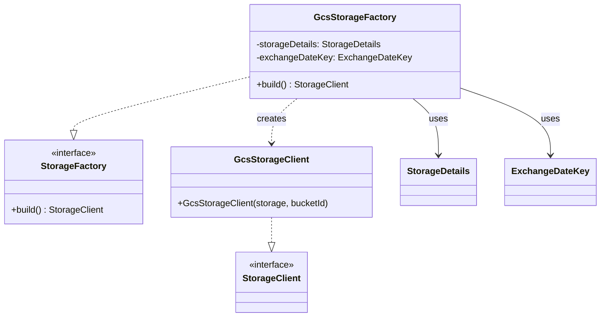

# org.wfanet.panelmatch.client.storage.gcloud.gcs

## Overview
This package provides a Google Cloud Storage (GCS) implementation of the StorageFactory interface for the Panel Match client. It handles the creation and configuration of GCS-backed storage clients with support for both static and rotating bucket strategies, enabling secure data exchange with bucket name fingerprinting.

## Components

### GcsStorageFactory
Factory class that creates GCS-backed StorageClient instances configured for Panel Match data exchange operations.

| Method | Parameters | Returns | Description |
|--------|------------|---------|-------------|
| build | None | `StorageClient` | Creates a configured GCS storage client with appropriate bucket and path prefix |

**Constructor Parameters:**
| Parameter | Type | Description |
|-----------|------|-------------|
| storageDetails | `StorageDetails` | Configuration containing GCS project, bucket, and visibility settings |
| exchangeDateKey | `ExchangeDateKey` | Exchange identifier used for path prefixing and rotating bucket name generation |

## Bucket Strategy

The factory supports two bucket types:

1. **STATIC_BUCKET** - Uses the bucket name directly from configuration
2. **ROTATING_BUCKET** - Generates deterministic bucket names by:
   - Computing SHA-512 fingerprint of storage details (bucket, project, visibility)
   - Computing SHA-512 fingerprint of exchange date key path
   - Combining fingerprints to create a 63-character bucket name (GCS limit)

## Private Functions

### fingerprint
| Parameters | Returns | Description |
|------------|---------|-------------|
| `data: String` | `String` | Computes SHA-512 hash of input and returns lowercase hex string |

## Dependencies
- `org.wfanet.measurement.gcloud.gcs.GcsStorageClient` - GCS storage client implementation
- `org.wfanet.measurement.storage.StorageClient` - Storage client interface
- `org.wfanet.measurement.common.HexString` - Hex encoding utility
- `org.wfanet.panelmatch.client.storage.StorageDetails` - Storage configuration proto
- `org.wfanet.panelmatch.common.storage.StorageFactory` - Factory interface
- `org.wfanet.panelmatch.common.ExchangeDateKey` - Exchange identifier
- `com.google.cloud.storage.StorageOptions` - GCS SDK configuration
- `com.google.protobuf.kotlin.toByteString` - Protobuf conversion utilities
- `java.security.MessageDigest` - Cryptographic hashing

## Usage Example
```kotlin
val storageDetails = StorageDetails.newBuilder()
  .setGcs(
    StorageDetails.GcsConfig.newBuilder()
      .setProjectName("my-gcs-project")
      .setBucket("my-bucket")
      .setBucketType(BucketType.STATIC_BUCKET)
  )
  .setVisibility(StorageDetails.Visibility.SHARED)
  .build()

val exchangeDateKey = ExchangeDateKey("exchange-2024-01-15")

val factory = GcsStorageFactory(storageDetails, exchangeDateKey)
val storageClient = factory.build()

// Storage client is now configured with:
// - Bucket: "my-bucket" (or fingerprinted bucket for ROTATING_BUCKET)
// - Prefix: "exchange-2024-01-15/"
```

## Class Diagram

