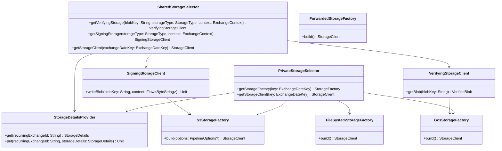

# org.wfanet.panelmatch.client.storage

## Overview
Provides storage abstraction layer for the panel match client workflow, supporting multiple cloud storage platforms (AWS S3, Google Cloud Storage, filesystem) with cryptographic signing and verification capabilities. The package manages both private party-specific storage and shared exchange storage with secure credential management and platform-agnostic interfaces.

## Components

### BlobNotFoundException
Exception thrown when a requested blob is not found in storage.

| Method | Parameters | Returns | Description |
|--------|------------|---------|-------------|
| constructor | `inputKey: String` | `BlobNotFoundException` | Creates exception with blob key |

### FileSystemStorageFactory
Creates filesystem-based storage clients with automatic directory creation for exchange-specific paths.

| Method | Parameters | Returns | Description |
|--------|------------|---------|-------------|
| constructor | `storageDetails: StorageDetails`, `exchangeDateKey: ExchangeDateKey` | `FileSystemStorageFactory` | Initializes factory with storage configuration |
| build | - | `StorageClient` | Creates FileSystemStorageClient with exchange path |

### PrivateStorageSelector
Selects and builds storage clients for private party-specific storage based on configured platform types.

| Method | Parameters | Returns | Description |
|--------|------------|---------|-------------|
| constructor | `privateStorageFactories: Map<PlatformCase, (StorageDetails, ExchangeDateKey) -> StorageFactory>`, `storageDetailsProvider: StorageDetailsProvider` | `PrivateStorageSelector` | Initializes selector with factory map and credentials |
| getStorageFactory | `key: ExchangeDateKey` | `StorageFactory` | Returns appropriate factory for exchange |
| getStorageClient | `key: ExchangeDateKey` | `StorageClient` | Builds storage client for exchange |

### SharedStorageSelector
Manages shared storage access with cryptographic signature creation and verification capabilities.

| Method | Parameters | Returns | Description |
|--------|------------|---------|-------------|
| constructor | `certificateManager: CertificateManager`, `sharedStorageFactories: Map<PlatformCase, (StorageDetails, ExchangeDateKey) -> StorageFactory>`, `storageDetailsProvider: StorageDetailsProvider` | `SharedStorageSelector` | Initializes selector with certificate manager |
| getVerifyingStorage | `blobKey: String`, `storageType: StorageType`, `context: ExchangeContext` | `VerifyingStorageClient` | Returns client for signature-verified reads |
| getSigningStorage | `storageType: StorageType`, `context: ExchangeContext` | `SigningStorageClient` | Returns client for signed writes |
| getStorageClient | `exchangeDateKey: ExchangeDateKey` | `StorageClient` | Returns basic storage client |

### SigningStorageClient
Writes blobs to shared storage with cryptographic signatures for authenticity verification.

| Method | Parameters | Returns | Description |
|--------|------------|---------|-------------|
| constructor | `sharedStorageFactory: StorageFactory`, `x509: X509Certificate`, `privateKey: PrivateKey`, `signatureTemplate: NamedSignature` | `SigningStorageClient` | Initializes client with signing credentials |
| writeBlob | `blobKey: String`, `content: Flow<ByteString>`, `pipelineOptions: PipelineOptions?` | `suspend Unit` | Writes blob and signature to storage |
| writeBlob | `blobKey: String`, `content: ByteString`, `pipelineOptions: PipelineOptions?` | `suspend Unit` | Writes single ByteString blob with signature |

### VerifyingStorageClient
Reads blobs from shared storage and cryptographically verifies their signatures using X.509 certificates.

| Method | Parameters | Returns | Description |
|--------|------------|---------|-------------|
| constructor | `sharedStorageFactory: StorageFactory`, `x509: X509Certificate` | `VerifyingStorageClient` | Initializes client with verification certificate |
| getBlob | `blobKey: String`, `pipelineOptions: PipelineOptions?` | `suspend VerifiedBlob` | Returns blob with signature verification |

#### VerifiedBlob
Wrapper ensuring blob signature verification occurs during read operations.

| Property | Type | Description |
|----------|------|-------------|
| size | `Long` | Size of underlying blob |
| signature | `ByteString` | Digital signature of blob |

| Method | Parameters | Returns | Description |
|--------|------------|---------|-------------|
| read | - | `Flow<ByteString>` | Reads blob with signature verification |
| toByteString | - | `suspend ByteString` | Reads entire blob as ByteString |
| toStringUtf8 | - | `suspend String` | Reads blob as UTF-8 string |

### StorageDetailsProvider
Securely retrieves and stores platform-specific storage configuration from encrypted secret storage.

| Method | Parameters | Returns | Description |
|--------|------------|---------|-------------|
| constructor | `secretMap: MutableSecretMap` | `StorageDetailsProvider` | Initializes provider with secret storage |
| get | `recurringExchangeId: String` | `suspend StorageDetails` | Retrieves storage config for exchange |
| put | `recurringExchangeId: String`, `storageDetails: StorageDetails` | `suspend Unit` | Stores storage config for exchange |

## Extensions

### Signatures.kt

| Function | Parameters | Returns | Description |
|----------|------------|---------|-------------|
| signatureBlobKeyFor | `blobKey: String` | `String` | Appends `.signature` suffix to blob key |
| getBlobSignature | `blobKey: String` | `suspend NamedSignature` | Reads and parses signature blob |

## Platform Implementations

### S3StorageFactory
Creates AWS S3 storage clients with IAM role assumption and session credentials support.

| Method | Parameters | Returns | Description |
|--------|------------|---------|-------------|
| constructor | `storageDetails: StorageDetails`, `exchangeDateKey: ExchangeDateKey` | `S3StorageFactory` | Initializes S3 factory |
| build | `options: PipelineOptions?` | `StorageClient` | Creates S3 client with credentials |
| build | - | `StorageClient` | Creates S3 client with default credentials |

### GcsStorageFactory
Creates Google Cloud Storage clients with support for static and rotating bucket naming schemes.

| Method | Parameters | Returns | Description |
|--------|------------|---------|-------------|
| constructor | `storageDetails: StorageDetails`, `exchangeDateKey: ExchangeDateKey` | `GcsStorageFactory` | Initializes GCS factory |
| build | - | `StorageClient` | Creates GCS client with bucket resolution |

### ForwardedStorageFactory
Creates forwarded storage clients that communicate with remote storage services via gRPC with TLS.

| Method | Parameters | Returns | Description |
|--------|------------|---------|-------------|
| constructor | `storageDetails: StorageDetails`, `exchangeDateKey: ExchangeDateKey` | `ForwardedStorageFactory` | Initializes forwarded storage factory |
| build | - | `StorageClient` | Creates gRPC-based forwarded storage client |

## Testing Utilities

### TestPrivateStorageSelector
Test fixture providing in-memory storage for private storage testing.

| Property | Type | Description |
|----------|------|-------------|
| storageClient | `InMemoryStorageClient` | In-memory storage backend |
| storageDetails | `TestMutableSecretMap` | Test secret storage |
| selector | `PrivateStorageSelector` | Configured test selector |

### TestSharedStorageSelector
Test fixture providing in-memory storage for shared storage testing with certificate management.

| Property | Type | Description |
|----------|------|-------------|
| storageClient | `InMemoryStorageClient` | In-memory storage backend |
| storageDetails | `TestMutableSecretMap` | Test secret storage |
| selector | `SharedStorageSelector` | Configured test selector |

### TestStorageClients.kt

| Function | Parameters | Returns | Description |
|----------|------------|---------|-------------|
| makeTestPrivateStorageSelector | `secretMap: MutableSecretMap`, `underlyingClient: InMemoryStorageClient` | `PrivateStorageSelector` | Creates test private storage selector |
| makeTestSharedStorageSelector | `secretMap: MutableSecretMap`, `underlyingClient: InMemoryStorageClient` | `SharedStorageSelector` | Creates test shared storage selector |
| makeTestVerifyingStorageClient | `underlyingClient: StorageClient` | `VerifyingStorageClient` | Creates test verifying client |
| makeTestSigningStorageClient | `underlyingClient: StorageClient` | `SigningStorageClient` | Creates test signing client |

### VerifiedStorageClientTest
Abstract test class for validating signed/verified storage operations.

| Method | Parameters | Returns | Description |
|--------|------------|---------|-------------|
| writeThenRead | - | `Unit` | Validates write and verified read |
| readMissingKeyFails | - | `Unit` | Validates exception on missing blob |
| writeSameKeyTwice | - | `Unit` | Validates blob overwrite behavior |

## Data Structures

### StorageDetails
Platform-specific storage configuration including credentials, bucket names, and visibility settings. Generated from protobuf definition.

| Field | Type | Description |
|-------|------|-------------|
| platformCase | `PlatformCase` | Storage platform type (AWS, GCS, FILE, CUSTOM) |
| visibility | `Visibility` | PRIVATE or SHARED storage classification |
| aws | `AwsDetails` | AWS S3 configuration |
| gcs | `GcsDetails` | Google Cloud Storage configuration |
| file | `FileDetails` | Filesystem storage configuration |
| custom | `CustomDetails` | Custom storage implementation config |

## Dependencies
- `org.wfanet.measurement.storage` - Core storage client abstractions
- `org.wfanet.measurement.aws.s3` - AWS S3 storage implementation
- `org.wfanet.measurement.gcloud.gcs` - Google Cloud Storage implementation
- `org.wfanet.measurement.common.crypto` - Cryptographic signing and verification
- `org.wfanet.panelmatch.common` - Exchange workflow identifiers and utilities
- `org.wfanet.panelmatch.common.certificates` - X.509 certificate management
- `org.wfanet.panelmatch.common.secrets` - Secure credential storage
- `org.wfanet.panelmatch.protocol` - Protocol buffer message definitions
- `software.amazon.awssdk` - AWS SDK for S3 access
- `com.google.cloud.storage` - Google Cloud Storage SDK
- `org.apache.beam.sdk` - Apache Beam pipeline integration

## Usage Example
```kotlin
// Configure private storage selector with multiple platforms
val privateStorageFactories = mapOf(
  PlatformCase.AWS to { details: StorageDetails, key: ExchangeDateKey ->
    S3StorageFactory(details, key)
  },
  PlatformCase.GCS to { details: StorageDetails, key: ExchangeDateKey ->
    GcsStorageFactory(details, key)
  }
)
val privateSelector = PrivateStorageSelector(
  privateStorageFactories,
  storageDetailsProvider
)

// Configure shared storage selector with signing/verification
val sharedSelector = SharedStorageSelector(
  certificateManager,
  sharedStorageFactories,
  storageDetailsProvider
)

// Write signed blob to shared storage
val signingClient = sharedSelector.getSigningStorage(
  StorageType.AMAZON_S3,
  exchangeContext
)
signingClient.writeBlob("data/output.bin", dataBytes)

// Read and verify signed blob
val verifyingClient = sharedSelector.getVerifyingStorage(
  "data/output.bin",
  StorageType.AMAZON_S3,
  exchangeContext
)
val verifiedData = verifyingClient.getBlob("data/output.bin").toByteString()
```

## Class Diagram

