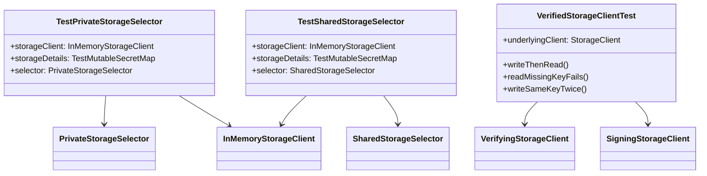

# org.wfanet.panelmatch.client.storage.testing

## Overview
Provides test utilities and fixtures for storage client implementations in the panel match system. This package supplies in-memory storage selectors, factory methods for creating verified and signed storage clients, and an abstract test suite for validating storage client behavior.

## Components

### TestPrivateStorageSelector
Test fixture bundling in-memory storage infrastructure for private storage testing.

| Property | Type | Description |
|----------|------|-------------|
| storageClient | `InMemoryStorageClient` | In-memory storage backend |
| storageDetails | `TestMutableSecretMap` | Test secret storage |
| selector | `PrivateStorageSelector` | Configured private storage selector |

### TestSharedStorageSelector
Test fixture bundling in-memory storage infrastructure for shared storage testing.

| Property | Type | Description |
|----------|------|-------------|
| storageClient | `InMemoryStorageClient` | In-memory storage backend |
| storageDetails | `TestMutableSecretMap` | Test secret storage |
| selector | `SharedStorageSelector` | Configured shared storage selector |

### VerifiedStorageClientTest
Abstract test suite validating signed and verified storage client interactions.

| Method | Parameters | Returns | Description |
|--------|------------|---------|-------------|
| writeThenRead | - | `Unit` | Verifies data written with signing client can be read with verifying client |
| readMissingKeyFails | - | `Unit` | Asserts reading non-existent key throws BlobNotFoundException |
| writeSameKeyTwice | - | `Unit` | Validates overwriting existing key updates value correctly |

| Property | Type | Description |
|----------|------|-------------|
| underlyingClient | `StorageClient` | Storage backend implementation to test (abstract) |

## Factory Functions

### makeTestPrivateStorageSelector
Creates a private storage selector configured for testing.

| Parameter | Type | Description |
|-----------|------|-------------|
| secretMap | `MutableSecretMap` | Storage for secret details |
| underlyingClient | `InMemoryStorageClient` | In-memory storage backend |

**Returns:** `PrivateStorageSelector` configured with test storage factories for FILE, AWS, and GCS platforms.

### makeTestSharedStorageSelector
Creates a shared storage selector configured for testing.

| Parameter | Type | Description |
|-----------|------|-------------|
| secretMap | `MutableSecretMap` | Storage for secret details |
| underlyingClient | `InMemoryStorageClient` | In-memory storage backend |

**Returns:** `SharedStorageSelector` configured with test certificate manager and storage factories.

### makeTestVerifyingStorageClient
Creates a verifying storage client for testing signature validation.

| Parameter | Type | Description |
|-----------|------|-------------|
| underlyingClient | `StorageClient` | Storage backend (defaults to InMemoryStorageClient) |

**Returns:** `VerifyingStorageClient` configured with test certificate.

### makeTestSigningStorageClient
Creates a signing storage client for testing signature generation.

| Parameter | Type | Description |
|-----------|------|-------------|
| underlyingClient | `StorageClient` | Storage backend (defaults to InMemoryStorageClient) |

**Returns:** `SigningStorageClient` configured with test certificate and private key.

## Dependencies
- `org.wfanet.measurement.storage.testing` - Provides InMemoryStorageClient for test storage
- `org.wfanet.panelmatch.common.secrets.testing` - Supplies TestMutableSecretMap for secret management
- `org.wfanet.panelmatch.common.certificates.testing` - Provides TestCertificateManager for cryptographic operations
- `org.wfanet.panelmatch.client.storage` - Core storage selector and client interfaces
- `org.wfanet.panelmatch.common.storage.testing` - Supplies InMemoryStorageFactory

## Usage Example
```kotlin
// Set up test storage infrastructure for private storage
val privateStorage = TestPrivateStorageSelector()
val data = "test-data".toByteStringUtf8()

// Use signing and verifying clients together
val signingClient = makeTestSigningStorageClient()
val verifyingClient = makeTestVerifyingStorageClient()

signingClient.writeBlob("key", data)
val retrieved = verifyingClient.getBlob("key")

// Extend the abstract test for custom storage implementations
class MyStorageTest : VerifiedStorageClientTest() {
  override val underlyingClient = MyCustomStorageClient()
}
```

## Class Diagram

