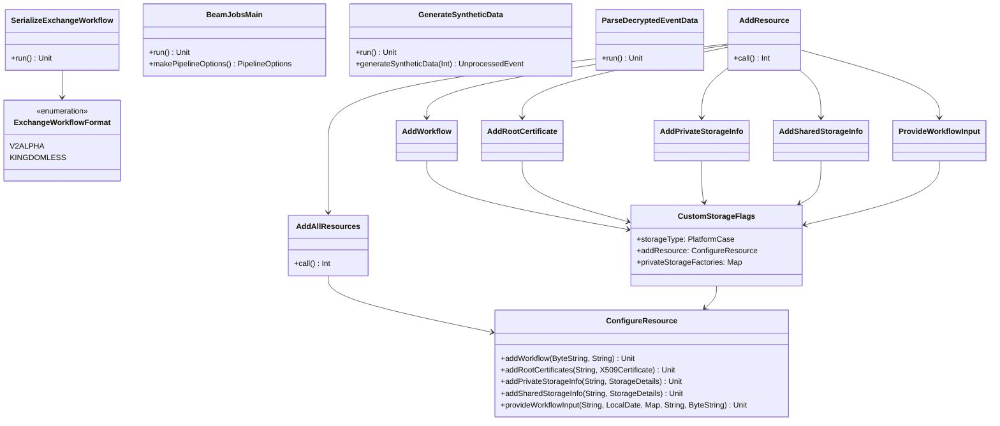

# org.wfanet.panelmatch.client.tools

## Overview
Command-line tools for configuring and managing panel match client resources, workflows, and data processing. Provides utilities for adding resources, running Beam jobs, generating synthetic data, parsing decrypted event data, and serializing exchange workflows across multiple storage platforms (GCS, AWS S3, local filesystem).

## Components

### AddResource
Main command dispatcher for resource configuration operations.

| Method | Parameters | Returns | Description |
|--------|------------|---------|-------------|
| call | - | `Int` | Returns 0 for success, delegates to subcommands |

**Subcommands:**
- `add_workflow` - AddWorkflow
- `add_root_certificate` - AddRootCertificate
- `add_private_storage_info` - AddPrivateStorageInfo
- `add_shared_storage_info` - AddSharedStorageInfo
- `provide_workflow_input` - ProvideWorkflowInput
- `add_all_resources` - AddAllResources

### AddAllResources
Adds all required resources in a single command operation.

| Method | Parameters | Returns | Description |
|--------|------------|---------|-------------|
| call | - | `Int` | Configures workflow, certificates, storage, and workflow input |

**Required Flags:**
- `--tink-key-uri` - Tink encryption key URI
- `--recurring-exchange-id` - Recurring exchange API resource name
- `--serialized-exchange-workflow-file` - Serialized ExchangeWorkflow file
- `--exchange-date` - Exchange date (YYYY-MM-DD)
- `--shared-storage-project` - GCS project name for shared storage
- `--shared-storage-bucket` - GCS bucket for shared storage
- `--partner-resource-name` - Partner API resource name
- `--partner-certificate-file` - Partner X.509 certificate file
- `--storage-type` - Storage platform (GCS, AWS, FILE)
- `--workflow-input-blob-key` - Blob key for workflow input
- `--workflow-input-blob-contents` - Workflow input file

### AddWorkflow
Adds an exchange workflow to storage.

| Method | Parameters | Returns | Description |
|--------|------------|---------|-------------|
| call | - | `Int` | Stores serialized ExchangeWorkflow for recurring exchange |

**Required Flags:**
- `--recurring-exchange-id` - Recurring exchange identifier
- `--serialized-exchange-workflow-file` - Binary workflow file
- `--start-date` - Workflow start date (YYYY-MM-DD)

### AddRootCertificate
Adds partner root certificate for secure communication.

| Method | Parameters | Returns | Description |
|--------|------------|---------|-------------|
| call | - | `Int` | Stores partner X.509 certificate in root storage |

**Required Flags:**
- `--partner-resource-name` - Partner identifier
- `--certificate-file` - X.509 certificate PEM/DER file

### AddPrivateStorageInfo
Adds private storage configuration from textproto.

| Method | Parameters | Returns | Description |
|--------|------------|---------|-------------|
| call | - | `Int` | Stores private StorageDetails configuration |

**Required Flags:**
- `--recurring-exchange-id` - Exchange identifier
- `--private-storage-info-file` - StorageDetails textproto file

### AddSharedStorageInfo
Adds shared storage configuration from textproto.

| Method | Parameters | Returns | Description |
|--------|------------|---------|-------------|
| call | - | `Int` | Stores shared StorageDetails configuration |

**Required Flags:**
- `--recurring-exchange-id` - Exchange identifier
- `--shared-storage-info-file` - StorageDetails textproto file

### ProvideWorkflowInput
Uploads workflow input data to private storage.

| Method | Parameters | Returns | Description |
|--------|------------|---------|-------------|
| call | - | `Int` | Writes blob contents to private storage at specified key |

**Required Flags:**
- `--recurring-exchange-id` - Exchange identifier
- `--exchange-date` - Exchange date (YYYY-MM-DD)
- `--blob-key` - Target storage blob key
- `--blob-contents` - Input data file

### ConfigureResource
Core resource configuration manager used by CLI commands.

| Method | Parameters | Returns | Description |
|--------|------------|---------|-------------|
| addWorkflow | `serializedWorkflow: ByteString`, `recurringExchangeId: String` | `suspend Unit` | Stores workflow in validExchangeWorkflows |
| addRootCertificates | `partnerId: String`, `certificate: X509Certificate` | `suspend Unit` | Stores encoded certificate in rootCertificates |
| addPrivateStorageInfo | `recurringExchangeId: String`, `storageDetails: StorageDetails` | `suspend Unit` | Stores private storage configuration |
| addSharedStorageInfo | `recurringExchangeId: String`, `storageDetails: StorageDetails` | `suspend Unit` | Stores shared storage configuration |
| provideWorkflowInput | `recurringExchangeId: String`, `date: LocalDate`, `privateStorageFactories: Map<...>`, `blobKey: String`, `contents: ByteString` | `suspend Unit` | Writes blob to private storage for exchange date |

### CustomStorageFlags
Reusable command-line flag mixin for storage configuration.

| Property | Type | Description |
|----------|------|-------------|
| storageType | `StorageDetails.PlatformCase` | Storage platform (GCS, AWS, FILE) |
| s3Bucket | `String` | S3 bucket name (AWS only) |
| s3Region | `String` | AWS region (AWS only) |
| addResource | `ConfigureResource` | Lazy-initialized resource configurator |
| privateStorageFactories | `Map<PlatformCase, (StorageDetails, ExchangeDateKey) -> StorageFactory>` | Platform-specific storage factories |

### BeamJobsMain
Executes Apache Beam tasks for exchange workflow steps.

| Method | Parameters | Returns | Description |
|--------|------------|---------|-------------|
| run | - | `Unit` | Executes exchange task with input/output blob handling |
| makePipelineOptions | - | `PipelineOptions` | Creates Spark runner configuration with TRACE logging |

**Required Flags:**
- `--exchange-workflow-blob-key` - Workflow blob key in storage
- `--step-index` - Exchange step index to execute
- `--exchange-step-attempt-resource-id` - Step attempt resource ID
- `--exchange-date` - Exchange date (YYYY-MM-DD)
- `--storage-type` - Storage platform (AWS, GCS, FILE)

**Optional Flags:**
- `--kingdomless` - Use kingdomless protocol (default: false)
- `--root-directory` - Filesystem root for FILE storage

**Supported Step Types:**
- DECRYPT_PRIVATE_MEMBERSHIP_QUERY_RESULTS_STEP

### GenerateSyntheticData
Generates synthetic panel match test data.

| Method | Parameters | Returns | Description |
|--------|------------|---------|-------------|
| run | - | `Unit` | Generates UnprocessedEvent and JoinKeyAndId data |
| generateSyntheticData | `id: Int` | `UnprocessedEvent` | Creates synthetic event with random timestamp |
| UnprocessedEvent.toJoinKeyAndId | - | `JoinKeyAndId` | Converts event to join key representation |
| writeCompressionParameters | - | `Unit` | Writes Brotli compression parameters if configured |

**Required Flags:**
- `--number_of_events` - Number of events to generate
- `--join_key_sample_rate` - Sample rate [0.0, 1.0] for join key selection

**Optional Flags:**
- `--unprocessed_events_output_path` - Output file (default: edp-unprocessed-events)
- `--join_keys_output_path` - Join keys output file (default: mp-plaintext-join-keys)
- `--brotli_dictionary_path` - Brotli dictionary for compression
- `--compression_parameters_output_path` - CompressionParameters output file
- `--previous_join_keys_input_path` - Previous join keys file
- `--previous_join_keys_output_path` - Copy destination for previous join keys

### ParseDecryptedEventData
Parses and converts decrypted event data to JSON.

| Method | Parameters | Returns | Description |
|--------|------------|---------|-------------|
| run | - | `Unit` | Parses sharded decrypted data and outputs JSON |
| ShardedFileName.parseAllShards | `parser: Parser<T>` | `Sequence<T>` | Parses delimited protobuf messages from shards |
| KeyedDecryptedEventDataSet.toDataProviderEventSetEntry | - | `DataProviderEventSet.Entry` | Converts decrypted data to event set entry |
| KeyedDecryptedEventDataSet.hasPaddingNonce | - | `Boolean` | Checks if entry is padding query |

**Required Flags:**
- `--manifest-path` - Manifest file path for decrypted data set
- `--output-path` - JSON output file path

**Optional Flags:**
- `--max-shards-to-parse` - Limit number of shards processed (default: -1 unlimited)

### SerializeExchangeWorkflow
Converts textproto ExchangeWorkflow to binary format.

| Method | Parameters | Returns | Description |
|--------|------------|---------|-------------|
| run | - | `Unit` | Parses textproto and writes binary output |

**Required Flags:**
- `--in` - Input textproto file path
- `--in-format` - Input format (V2ALPHA or KINGDOMLESS)
- `--out` - Output binary file path

**Supported Types:**
- V2ALPHA - `org.wfanet.measurement.api.v2alpha.ExchangeWorkflow`
- KINGDOMLESS - `org.wfanet.panelmatch.client.internal.ExchangeWorkflow`
- RLWE parameters - `private_membership.batch.Parameters`

## Data Structures

### ExchangeWorkflowFormat
| Value | Description |
|-------|-------------|
| V2ALPHA | API v2alpha format ExchangeWorkflow |
| KINGDOMLESS | Internal format for kingdom-less exchanges |

## Dependencies
- `org.wfanet.measurement.storage` - Storage client abstractions (GCS, S3, filesystem)
- `org.wfanet.measurement.common.crypto` - Certificate reading and Tink encryption
- `org.wfanet.panelmatch.client.storage` - Storage factories and selectors
- `org.wfanet.panelmatch.client.deploy` - Daemon storage client defaults
- `org.wfanet.panelmatch.client.exchangetasks` - Exchange task execution
- `org.wfanet.panelmatch.common` - Common utilities and storage abstractions
- `com.google.crypto.tink` - KMS client integrations (GCP, AWS)
- `picocli` - Command-line parsing framework
- `org.apache.beam` - Distributed data processing (Spark runner)
- `com.google.protobuf` - Protocol buffer serialization
- `kotlinx.coroutines` - Asynchronous execution

## Usage Example
```kotlin
// Add all resources for an exchange
val command = arrayOf(
  "add_all_resources",
  "--tink-key-uri", "gcp-kms://projects/my-project/locations/us/keyRings/my-ring/cryptoKeys/my-key",
  "--recurring-exchange-id", "recurringExchanges/123",
  "--serialized-exchange-workflow-file", "/path/to/workflow.pb",
  "--exchange-date", "2024-01-15",
  "--shared-storage-project", "shared-project",
  "--shared-storage-bucket", "shared-bucket",
  "--partner-resource-name", "dataProviders/456",
  "--partner-certificate-file", "/path/to/partner.pem",
  "--storage-type", "GCS",
  "--project-name", "my-project",
  "--bucket", "my-bucket",
  "--workflow-input-blob-key", "input/data.pb",
  "--workflow-input-blob-contents", "/path/to/input.pb"
)
CommandLine(AddResource()).execute(*command)

// Generate synthetic test data
val syntheticCommand = arrayOf(
  "--number_of_events", "1000",
  "--join_key_sample_rate", "0.01",
  "--unprocessed_events_output_path", "/tmp/events.pb",
  "--join_keys_output_path", "/tmp/join-keys.pb"
)
commandLineMain(GenerateSyntheticData(), syntheticCommand)

// Run Beam job for exchange step
val beamCommand = arrayOf(
  "--exchange-workflow-blob-key", "workflows/exchange-123.pb",
  "--step-index", "2",
  "--exchange-step-attempt-resource-id", "recurringExchanges/123/exchanges/456/steps/2/attempts/1",
  "--exchange-date", "2024-01-15",
  "--storage-type", "GCS",
  "--project-name", "my-project",
  "--bucket", "my-bucket"
)
commandLineMain(BeamJobsMain(), beamCommand)
```

## Class Diagram

