# org.wfanet.panelmatch.common.beam

## Overview
Apache Beam utilities and extension functions for the Panel Match system. Provides Kotlin-idiomatic wrappers around Beam PTransforms, PCollection operations, and I/O utilities for reading/writing sharded data to cloud storage. Enables functional-style pipeline construction with map, filter, flatMap, and join operations.

## Components

### Beam.kt - Extension Functions

Core Kotlin extension functions for Apache Beam PCollections and Pipelines.

| Method | Parameters | Returns | Description |
|--------|------------|---------|-------------|
| kvOf | `key: KeyT, value: ValueT` | `KV<KeyT, ValueT>` | Creates Beam KV pairs |
| keys | `name: String = "Keys"` | `PCollection<KeyT>` | Extracts keys from KV PCollection |
| values | `name: String = "Values"` | `PCollection<ValueT>` | Extracts values from KV PCollection |
| parDo | `doFn: DoFn<InT, OutT>, name: String = "ParDo"` | `PCollection<OutT>` | Applies DoFn transformation |
| parDo | `name: String, processElement: suspend SequenceScope<OutT>.(InT) -> Unit` | `PCollection<OutT>` | Applies lambda-based transformation |
| filter | `name: String, predicate: (T) -> Boolean` | `PCollection<T>` | Filters elements by predicate |
| map | `name: String, processElement: (InT) -> OutT` | `PCollection<OutT>` | One-to-one element transformation |
| flatMap | `name: String, processElement: (InT) -> Iterable<OutT>` | `PCollection<OutT>` | One-to-many element transformation |
| keyBy | `name: String, keySelector: (InputT) -> KeyT` | `PCollection<KV<KeyT, InputT>>` | Keys collection by function |
| mapKeys | `name: String, processKey: (InKeyT) -> OutKeyT` | `PCollection<KV<OutKeyT, ValueT>>` | Transforms only KV keys |
| mapValues | `name: String, processValue: (InValueT) -> OutValueT` | `PCollection<KV<KeyT, OutValueT>>` | Transforms only KV values |
| partition | `numParts: Int, name: String, partitionBy: (T) -> Int` | `PCollectionList<T>` | Partitions collection into N parts |
| join | `right: PCollection<KV<KeyT, RightT>>, name: String, transform: ...` | `PCollection<OutT>` | CoGroupByKey-based join operation |
| strictOneToOneJoin | `right: PCollection<KV<KeyT, RightT>>, name: String` | `PCollection<KV<LeftT, RightT>>` | Joins requiring exactly one element per key |
| oneToOneJoin | `right: PCollection<KV<KeyT, RightT>>, name: String` | `PCollection<KV<LeftT?, RightT?>>` | Joins with at most one element per key |
| count | `name: String = "Count"` | `PCollectionView<Long>` | Counts elements as side input view |
| toPCollectionList | - | `PCollectionList<T>` | Converts Iterable of PCollections to list |
| flatten | `name: String = "Flatten"` | `PCollection<T>` | Flattens PCollectionList into single collection |
| parDoWithSideInput | `sideInput: PCollectionView<SideT>, name: String, processElement: ...` | `PCollection<OutT>` | ParDo with single side input |
| mapWithSideInput | `sideInput: PCollectionView<SideT>, name: String, processElement: ...` | `PCollection<OutT>` | Map with single side input |
| groupByKey | `name: String = "GroupByKey"` | `PCollection<KV<KeyT, Iterable<ValueT>>>` | Groups values by key |
| toSingletonView | `name: String = "ToView"` | `PCollectionView<T>` | Creates singleton side input view |
| toMapView | `name: String = "ToMapView"` | `PCollectionView<Map<K, V>>` | Creates map side input view |
| combineIntoList | `name: String = "CombineIntoList"` | `PCollection<List<T>>` | Combines all elements into single list |
| breakFusion | `name: String = "BreakFusion"` | `PCollection<T>` | Forces materialization to break fusion |
| createSequence | `n: Int, parallelism: Int = 1000, name: String` | `PCollection<Int>` | Creates sequence from 0 to n-1 |
| minus | `other: PCollection<T>, name: String = "Minus"` | `PCollection<T>` | Set difference operation |

### BeamOptions

Pipeline options interface extending Dataflow and SDK harness options.

| Property | Type | Description |
|----------|------|-------------|
| awsAccessKey | `String` | AWS access key credential |
| awsSecretAccessKey | `String` | AWS secret access key credential |
| awsSessionToken | `String` | AWS session token credential |

### BreakFusion

PTransform that forces materialization to prevent Dataflow operation fusion.

| Method | Parameters | Returns | Description |
|--------|------------|---------|-------------|
| expand | `input: PCollection<T>` | `PCollection<T>` | Keys by UUID, groups, and flattens to break fusion |

**Purpose**: Prevents fusion between operations with different processing requirements or data sizes, allowing independent worker allocation.

### Coders

Pre-configured coder instances for common types.

| Property | Type | Description |
|----------|------|-------------|
| byteStringKvCoder | `Coder<KV<ByteString, ByteString>>` | Coder for ByteString key-value pairs |

### Minus

PTransform computing set difference between two PCollections.

| Method | Parameters | Returns | Description |
|--------|------------|---------|-------------|
| expand | `input: PCollectionList<T>` | `PCollection<T>` | Returns elements in first collection not in second |

**Constraints**: Input list must contain exactly 2 PCollections.

### ReadAsSingletonPCollection

PTransform reading single blob from storage into PCollection.

| Method | Parameters | Returns | Description |
|--------|------------|---------|-------------|
| expand | `input: PBegin` | `PCollection<ByteString>` | Reads blob and outputs as ByteString |

**Constructor Parameters**:
- `blobKey: String` - Storage key for blob
- `storageFactory: StorageFactory` - Factory for storage client

### ReadShardedData

PTransform reading sharded Protocol Buffer messages from storage.

| Method | Parameters | Returns | Description |
|--------|------------|---------|-------------|
| expand | `input: PBegin` | `PCollection<T>` | Reads all shards and outputs messages |

**Constructor Parameters**:
- `prototype: T` - Protobuf message prototype for parsing
- `fileSpec: String` - Sharded filename specification
- `storageFactory: StorageFactory` - Factory for storage client

**Features**:
- Parses delimited protobuf messages from each shard
- Tracks metrics: item sizes and element counts per shard
- Uses coroutines for async I/O operations

### WriteShardedData

PTransform writing Protocol Buffer messages to sharded storage files.

| Method | Parameters | Returns | Description |
|--------|------------|---------|-------------|
| expand | `input: PCollection<T>` | `WriteResult` | Distributes messages to shards and writes |
| assignToShard | `shardCount: Int` | `Int` | Computes shard index from hashcode |

**Constructor Parameters**:
- `fileSpec: String` - Sharded filename specification
- `storageFactory: StorageFactory` - Factory for storage client

**Features**:
- Hash-based shard assignment for even distribution
- Creates empty files for missing shards
- Returns WriteResult containing written filenames

#### WriteResult

POutput containing filenames written by WriteShardedData.

| Method | Parameters | Returns | Description |
|--------|------------|---------|-------------|
| getPipeline | - | `Pipeline` | Returns parent pipeline |
| expand | - | `Map<TupleTag<*>, PValue>` | Returns tagged output map |

### WriteSingleBlob

PTransform writing single Protocol Buffer message to blob storage.

| Method | Parameters | Returns | Description |
|--------|------------|---------|-------------|
| expand | `input: PCollection<T>` | `WriteResult` | Validates single element and writes blob |

**Constructor Parameters**:
- `blobKey: String` - Storage key for output blob
- `storageFactory: StorageFactory` - Factory for storage client

**Constraints**: Input PCollection must contain exactly one element.

#### WriteResult

POutput containing blob key written by WriteSingleBlob.

| Method | Parameters | Returns | Description |
|--------|------------|---------|-------------|
| getPipeline | - | `Pipeline` | Returns parent pipeline |
| expand | - | `Map<TupleTag<*>, PValue>` | Returns tagged output map |

## Testing

### BeamTestBase

JUnit base class for Apache Beam pipeline tests.

| Property | Type | Description |
|----------|------|-------------|
| beamTemporaryFolder | `TemporaryFolder` | JUnit temporary folder for test files |
| pipeline | `TestPipeline` | Auto-running test pipeline instance |

| Method | Parameters | Returns | Description |
|--------|------------|---------|-------------|
| pcollectionOf | `name: String, values: T..., coder: Coder<T>?` | `PCollection<T>` | Creates test PCollection from varargs |
| pcollectionOf | `name: String, values: Iterable<T>, coder: Coder<T>?` | `PCollection<T>` | Creates test PCollection from iterable |
| pcollectionViewOf | `name: String, value: T, coder: Coder<T>?` | `PCollectionView<T>` | Creates singleton test view |
| assertThat | `pCollection: PCollection<T>` | `PAssert.IterableAssert<T>` | Creates assertion for PCollection |
| assertThat | `view: PCollectionView<T>` | `PAssert.IterableAssert<T>` | Creates assertion for PCollectionView |

## Dependencies

- `org.apache.beam:beam-sdk-java` - Core Apache Beam SDK
- `org.apache.beam:beam-runners-dataflow` - Dataflow runner support
- `org.apache.beam:beam-extensions-protobuf` - Protocol Buffer coders
- `org.apache.beam:beam-sdk-testing` - Testing utilities
- `com.google.protobuf:protobuf-java` - Protocol Buffer runtime
- `org.jetbrains.kotlinx:kotlinx-coroutines-core` - Kotlin coroutines
- `org.wfanet.panelmatch.common` - Panel Match common utilities
- `org.wfanet.panelmatch.common.storage` - Storage abstraction layer
- `org.wfanet.measurement.storage` - Storage client interfaces
- `org.junit:junit` - JUnit 4 testing framework

## Usage Example

```kotlin
// Build a pipeline with functional-style operations
val pipeline = Pipeline.create()

// Read sharded protobuf data
val messages = pipeline.apply(
  ReadShardedData(
    prototype = MyProto.getDefaultInstance(),
    fileSpec = "gs://bucket/data-*.pb",
    storageFactory = storageFactory
  )
)

// Transform using extension functions
val results = messages
  .filter("FilterValid") { it.isValid }
  .map("ExtractId") { it.id }
  .keyBy("KeyById") { it }
  .groupByKey("GroupDuplicates")
  .mapValues("CountDuplicates") { it.count() }
  .filter("RemoveSingletons") { it.value > 1 }

// Write results to sharded storage
results.apply(
  WriteShardedData(
    fileSpec = "gs://bucket/output-*.pb",
    storageFactory = storageFactory
  )
)

pipeline.run().waitUntilFinish()
```

## Class Diagram

```mermaid
classDiagram
    class BreakFusion~T~ {
        +expand(input: PCollection~T~) PCollection~T~
    }

    class Minus~T~ {
        +expand(input: PCollectionList~T~) PCollection~T~
    }

    class ReadAsSingletonPCollection {
        -blobKey: String
        -storageFactory: StorageFactory
        +expand(input: PBegin) PCollection~ByteString~
    }

    class ReadShardedData~T~ {
        -prototype: T
        -fileSpec: String
        -storageFactory: StorageFactory
        +expand(input: PBegin) PCollection~T~
    }

    class WriteShardedData~T~ {
        -fileSpec: String
        -storageFactory: StorageFactory
        +expand(input: PCollection~T~) WriteResult
        +assignToShard(shardCount: Int) Int
    }

    class WriteSingleBlob~T~ {
        -blobKey: String
        -storageFactory: StorageFactory
        +expand(input: PCollection~T~) WriteResult
    }

    class WriteResult {
        +getPipeline() Pipeline
        +expand() Map
    }

    class BeamOptions {
        <<interface>>
        +awsAccessKey: String
        +awsSecretAccessKey: String
        +awsSessionToken: String
    }

    class BeamTestBase {
        +beamTemporaryFolder: TemporaryFolder
        +pipeline: TestPipeline
        +pcollectionOf(...) PCollection
        +pcollectionViewOf(...) PCollectionView
    }

    BreakFusion ..|> PTransform
    Minus ..|> PTransform
    ReadAsSingletonPCollection ..|> PTransform
    ReadShardedData ..|> PTransform
    WriteShardedData ..|> PTransform
    WriteSingleBlob ..|> PTransform
    WriteShardedData ..> WriteResult : creates
    WriteSingleBlob ..> WriteResult : creates
    WriteResult ..|> POutput
    BeamOptions --|> DataflowPipelineOptions
    BeamOptions --|> SdkHarnessOptions
    ReadAsSingletonPCollection --> StorageFactory
    ReadShardedData --> StorageFactory
    WriteShardedData --> StorageFactory
    WriteSingleBlob --> StorageFactory
```


