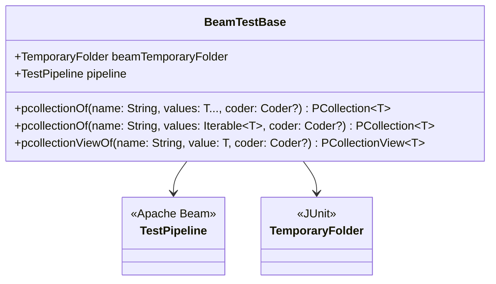

# org.wfanet.panelmatch.common.beam.testing

## Overview
Test infrastructure package for Apache Beam pipeline testing. Provides base class and utilities for writing unit tests for Beam transformations, including simplified PCollection creation, test pipeline configuration, and assertion helpers.

## Components

### BeamTestBase
Base class for Apache Beam unit tests providing pre-configured test pipeline and convenience methods for PCollection creation.

| Method | Parameters | Returns | Description |
|--------|------------|---------|-------------|
| pcollectionOf | `name: String, vararg values: T, coder: Coder<T>?` | `PCollection<T>` | Creates PCollection from variadic arguments |
| pcollectionOf | `name: String, values: Iterable<T>, coder: Coder<T>?` | `PCollection<T>` | Creates PCollection from iterable values |
| pcollectionViewOf | `name: String, value: T, coder: Coder<T>?` | `PCollectionView<T>` | Creates singleton PCollectionView from single value |

**Properties:**
| Property | Type | Description |
|----------|------|-------------|
| beamTemporaryFolder | `TemporaryFolder` | JUnit rule providing temporary directory for test artifacts |
| pipeline | `TestPipeline` | Pre-configured test pipeline with auto-run enabled |

**Configuration:**
- Disables stable unique names requirement
- Configures temporary location using TemporaryFolder
- Enables auto-run if missing assertions
- Disables abandoned node enforcement

### assertThat (Extension Functions)

| Function | Parameters | Returns | Description |
|----------|------------|---------|-------------|
| assertThat | `pCollection: PCollection<T>` | `PAssert.IterableAssert<T>` | Creates assertion builder for PCollection contents |
| assertThat | `view: PCollectionView<T>` | `PAssert.IterableAssert<T>` | Creates assertion builder for PCollectionView by extracting side input |

## Dependencies
- `org.apache.beam.sdk.coders` - Coder interface for serialization
- `org.apache.beam.sdk.options` - Pipeline configuration options
- `org.apache.beam.sdk.testing` - TestPipeline and PAssert for testing
- `org.apache.beam.sdk.transforms` - Create, DoFn, ParDo, View transforms
- `org.apache.beam.sdk.values` - PCollection and PCollectionView types
- `org.junit` - JUnit 4 Rule and TemporaryFolder

## Usage Example
```kotlin
class MyBeamTest : BeamTestBase() {
  @Test
  fun testTransformation() {
    // Create test input
    val input = pcollectionOf("Input", 1, 2, 3)

    // Apply transformation
    val output = input.apply(MyTransform())

    // Assert results
    assertThat(output).containsInAnyOrder(2, 4, 6)
  }

  @Test
  fun testWithSideInput() {
    // Create side input view
    val config = pcollectionViewOf("Config", "multiplier:5")

    // Use in transformation
    val result = pcollectionOf("Numbers", 1, 2, 3)
      .apply(ParDo.of(MyDoFn()).withSideInputs(config))

    // Verify side input usage
    assertThat(config).containsInAnyOrder("multiplier:5")
  }
}
```

## Class Diagram

