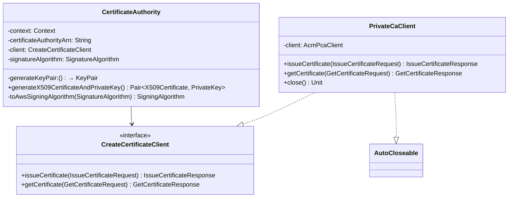

# org.wfanet.panelmatch.common.certificates.aws

## Overview
Provides AWS ACM Private CA integration for X.509 certificate generation and management. This package implements the certificate authority interface using AWS Certificate Manager Private Certificate Authority, enabling automatic certificate issuance with configurable key usage, extensions, and validity periods.

## Components

### CertificateAuthority
Implements certificate authority functionality using AWS ACM Private CA to generate X.509 certificates with private keys.

| Method | Parameters | Returns | Description |
|--------|------------|---------|-------------|
| generateX509CertificateAndPrivateKey | None | `Pair<X509Certificate, PrivateKey>` | Generates CSR, issues certificate via AWS CA, retrieves signed certificate |
| toAwsSigningAlgorithm | `this: SignatureAlgorithm` | `SigningAlgorithm` | Converts internal signature algorithm to AWS signing algorithm enum |

**Constructor Parameters:**
| Parameter | Type | Description |
|-----------|------|-------------|
| context | `CertificateAuthority.Context` | Contains common name, organization, DNS name, and validity days |
| certificateAuthorityArn | `String` | AWS ARN of the private CA |
| client | `CreateCertificateClient` | Client for issuing and retrieving certificates |
| signatureAlgorithm | `SignatureAlgorithm` | Algorithm for signing CSR and certificate |
| generateKeyPair | `() -> KeyPair` | Function to generate cryptographic key pairs |

### CreateCertificateClient
Interface defining operations for certificate issuance and retrieval from AWS ACM Private CA.

| Method | Parameters | Returns | Description |
|--------|------------|---------|-------------|
| issueCertificate | `request: IssueCertificateRequest` | `IssueCertificateResponse` | Submits certificate signing request to AWS CA |
| getCertificate | `request: GetCertificateRequest` | `GetCertificateResponse` | Retrieves issued certificate from AWS CA |

### PrivateCaClient
Concrete implementation of CreateCertificateClient using AWS SDK's AcmPcaClient with automatic resource management.

| Method | Parameters | Returns | Description |
|--------|------------|---------|-------------|
| issueCertificate | `request: IssueCertificateRequest` | `IssueCertificateResponse` | Issues certificate via AWS ACM PCA |
| getCertificate | `request: GetCertificateRequest` | `GetCertificateResponse` | Waits for certificate issuance and retrieves result |
| close | None | `Unit` | Closes underlying AWS client connection |

## Constants

| Name | Value | Description |
|------|-------|-------------|
| AWS_CERTIFICATE_TEMPLATE_ARN | `arn:aws:acm-pca:::template/BlankSubordinateCACertificate_PathLen0_APIPassthrough/V1` | AWS template for subordinate CA certificates with path length 0 |

## Dependencies
- `software.amazon.awssdk.services.acmpca` - AWS SDK for ACM Private CA operations
- `org.wfanet.measurement.common.crypto` - Signature algorithms and certificate reading utilities
- `org.wfanet.panelmatch.common.certificates` - Base CertificateAuthority interface and CSR generation
- `java.security` - Java cryptographic primitives (KeyPair, PrivateKey, X509Certificate)

## Usage Example
```kotlin
val context = CertificateAuthority.Context(
  commonName = "example.com",
  organization = "Example Org",
  dnsName = "*.example.com",
  validDays = 365
)

val client = PrivateCaClient()
val ca = CertificateAuthority(
  context = context,
  certificateAuthorityArn = "arn:aws:acm-pca:us-east-1:123456789012:certificate-authority/abc-123",
  client = client,
  signatureAlgorithm = SignatureAlgorithm.ECDSA_WITH_SHA256,
  generateKeyPair = { KeyPairGenerator.getInstance("EC").generateKeyPair() }
)

val (certificate, privateKey) = ca.generateX509CertificateAndPrivateKey()

client.close()
```

## Class Diagram


## Certificate Configuration

The CertificateAuthority class configures certificates with the following attributes:

**Key Usage:**
- Digital Signature
- Non-Repudiation
- Key Encipherment

**Extended Key Usage:**
- Server Authentication

**Subject Alternative Names:**
- DNS name from context

**Validity:**
- Configurable via context.validDays

## Supported Signature Algorithms

| Internal Algorithm | AWS Signing Algorithm |
|--------------------|----------------------|
| ECDSA_WITH_SHA256 | SHA256_WITHECDSA |
| ECDSA_WITH_SHA384 | SHA384_WITHECDSA |
| ECDSA_WITH_SHA512 | SHA512_WITHECDSA |
| SHA_256_WITH_RSA_ENCRYPTION | SHA256_WITHRSA |
| SHA_384_WITH_RSA_ENCRYPTION | SHA384_WITHRSA |
| SHA_512_WITH_RSA_ENCRYPTION | SHA512_WITHRSA |
