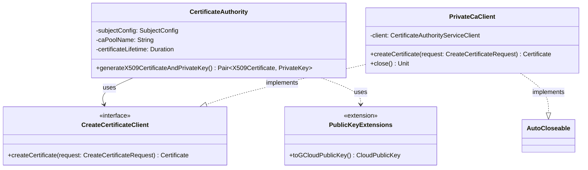

# org.wfanet.panelmatch.common.certificates.gcloud

## Overview
This package provides Google Cloud Private Certificate Authority (CA) integration for generating X.509 certificates within the panel match system. It implements the certificate authority interface using Google Cloud's Certificate Authority Service, enabling secure certificate generation with configurable key usage parameters and subject configurations.

## Components

### CertificateAuthority
Concrete implementation of the CertificateAuthority interface using Google Cloud Private CA service to generate X.509 certificates and private keys.

| Method | Parameters | Returns | Description |
|--------|------------|---------|-------------|
| generateX509CertificateAndPrivateKey | - | `suspend Pair<X509Certificate, PrivateKey>` | Generates new key pair and requests signed certificate from GCP Private CA |

**Constructor Parameters:**
| Parameter | Type | Description |
|-----------|------|-------------|
| context | `CertificateAuthority.Context` | Certificate metadata (commonName, organization, dnsName, validDays) |
| projectId | `String` | Google Cloud project identifier |
| caLocation | `String` | Geographic location of the CA pool |
| poolId | `String` | Certificate Authority pool identifier |
| certificateAuthorityName | `String` | Specific CA within the pool to use for signing |
| client | `CreateCertificateClient` | Client interface for certificate creation |
| generateKeyPair | `() -> KeyPair` | Key pair generator (defaults to EC algorithm) |

### CreateCertificateClient
Interface defining the contract for certificate creation clients that interact with Google Cloud Private CA.

| Method | Parameters | Returns | Description |
|--------|------------|---------|-------------|
| createCertificate | `request: CreateCertificateRequest` | `suspend Certificate` | Submits certificate signing request to CA service |

### PrivateCaClient
Production implementation of CreateCertificateClient using Google's CertificateAuthorityServiceClient.

| Method | Parameters | Returns | Description |
|--------|------------|---------|-------------|
| createCertificate | `request: CreateCertificateRequest` | `suspend Certificate` | Delegates to Google's CA service client |
| close | - | `Unit` | Releases underlying client resources |

**Interfaces Implemented:**
- `CreateCertificateClient`
- `AutoCloseable`

## Data Structures

### X509_PARAMETERS
Top-level constant defining fixed X.509 certificate parameters.

| Property | Value | Description |
|----------|-------|-------------|
| keyUsage.baseKeyUsage.digitalSignature | `true` | Enables digital signature operations |
| keyUsage.baseKeyUsage.keyEncipherment | `true` | Enables key encryption operations |
| keyUsage.baseKeyUsage.certSign | `true` | Enables certificate signing capability |
| keyUsage.extendedKeyUsage.serverAuth | `true` | Enables TLS server authentication (RFC 5280) |
| caOptions.isCa | `true` | Marks certificates as CA certificates |

## Extensions

### PublicKey.toGCloudPublicKey()
Converts Java standard library PublicKey to Google Cloud Platform PublicKey format.

| Extension On | Returns | Description |
|--------------|---------|-------------|
| `java.security.PublicKey` | `CloudPublicKey` | Encodes key as PEM and wraps in GCP PublicKey proto |

## Dependencies
- `com.google.cloud.security.privateca.v1` - Google Cloud Private CA API (Certificate, CaPoolName, CreateCertificateRequest)
- `org.wfanet.panelmatch.common.certificates.CertificateAuthority` - Base interface for certificate generation
- `org.wfanet.measurement.common.crypto` - Cryptographic utilities (generateKeyPair, readCertificate, PemWriter)
- `java.security` - JCA/JCE security primitives (KeyPair, PrivateKey, PublicKey, X509Certificate)
- `com.google.protobuf.ByteString` - Protocol buffer byte handling

## Usage Example
```kotlin
// Configure certificate authority
val context = CertificateAuthority.Context(
  commonName = "my-service.example.com",
  organization = "Example Organization",
  dnsName = "my-service.example.com",
  validDays = 365
)

val client = PrivateCaClient()
val ca = CertificateAuthority(
  context = context,
  projectId = "my-gcp-project",
  caLocation = "us-central1",
  poolId = "my-ca-pool",
  certificateAuthorityName = "my-ca",
  client = client
)

// Generate certificate and private key
val (certificate, privateKey) = ca.generateX509CertificateAndPrivateKey()

// Clean up resources
client.close()
```

## Class Diagram

