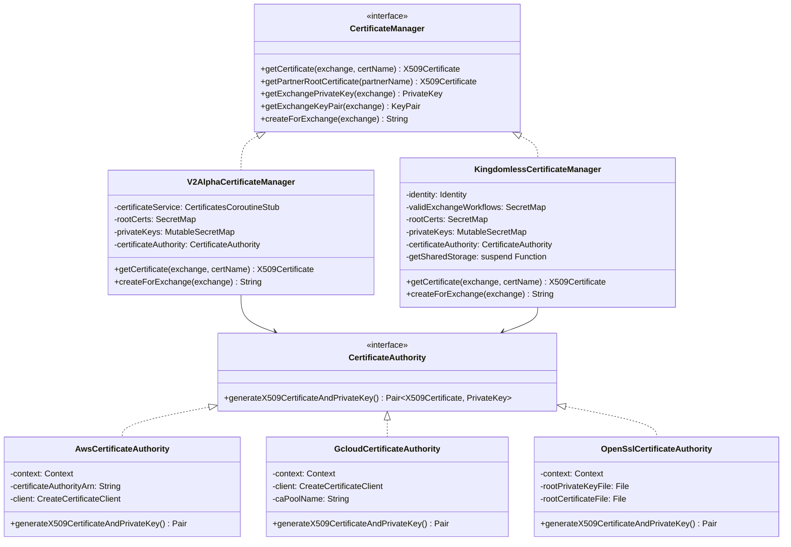

# org.wfanet.panelmatch.common.certificates

## Overview
Provides X.509 certificate management infrastructure for the Panel Match system, including certificate authorities, certificate managers, and platform-specific implementations for AWS and Google Cloud. The package supports both Kingdom-based and Kingdom-less certificate workflows with secure key storage and multi-party certificate verification.

## Components

### CertificateAuthority
Interface for generating X.509 certificates signed by a protected root private key.

| Method | Parameters | Returns | Description |
|--------|------------|---------|-------------|
| generateX509CertificateAndPrivateKey | - | `Pair<X509Certificate, PrivateKey>` | Creates key pair and certificate signed by root CA |

### CertificateManager
Interface for managing X.509 certificates and private keys across exchanges.

| Method | Parameters | Returns | Description |
|--------|------------|---------|-------------|
| getCertificate | `exchange: ExchangeDateKey`, `certName: String` | `X509Certificate` | Retrieves certificate by name for an exchange |
| getPartnerRootCertificate | `partnerName: String` | `X509Certificate` | Retrieves root certificate for a partner |
| getExchangePrivateKey | `exchange: ExchangeDateKey` | `PrivateKey` | Retrieves private key for current exchange |
| getExchangeKeyPair | `exchange: ExchangeDateKey` | `KeyPair` | Retrieves certificate and private key pair |
| createForExchange | `exchange: ExchangeDateKey` | `String` | Creates new certificate and private key for exchange |

### KingdomlessCertificateManager
Implementation that maintains certificates in shared storage without Kingdom service dependency.

| Method | Parameters | Returns | Description |
|--------|------------|---------|-------------|
| getCertificate | `exchange: ExchangeDateKey`, `certName: String` | `X509Certificate` | Retrieves and validates certificate from shared storage |
| getPartnerRootCertificate | `partnerName: String` | `X509Certificate` | Retrieves root certificate from secret storage |
| getExchangePrivateKey | `exchange: ExchangeDateKey` | `PrivateKey` | Retrieves private key from secret storage |
| getExchangeKeyPair | `exchange: ExchangeDateKey` | `KeyPair` | Retrieves certificate and key with fallback support |
| createForExchange | `exchange: ExchangeDateKey` | `String` | Generates certificate, stores in shared storage |

### V2AlphaCertificateManager
Implementation that loads certificates from Kingdom v2alpha API service.

| Method | Parameters | Returns | Description |
|--------|------------|---------|-------------|
| getCertificate | `exchange: ExchangeDateKey`, `certName: String` | `X509Certificate` | Retrieves certificate via gRPC from Kingdom API |
| getPartnerRootCertificate | `partnerName: String` | `X509Certificate` | Retrieves root certificate for verification |
| getExchangePrivateKey | `exchange: ExchangeDateKey` | `PrivateKey` | Retrieves private key from secret storage |
| getExchangeKeyPair | `exchange: ExchangeDateKey` | `KeyPair` | Retrieves certificate and key with fallback |
| createForExchange | `exchange: ExchangeDateKey` | `String` | Creates certificate via CA and registers with Kingdom |

### CertificateSigningRequests
Utility object for generating PKCS#10 certificate signing requests.

| Method | Parameters | Returns | Description |
|--------|------------|---------|-------------|
| generateCsrFromKeyPair | `keyPair: KeyPair`, `organization: String`, `commonName: String`, `signatureAlgorithm: SignatureAlgorithm` | `String` | Generates PEM-encoded CSR from key pair |

## Platform-Specific Implementations

### aws.CertificateAuthority
AWS Private CA implementation of CertificateAuthority.

| Method | Parameters | Returns | Description |
|--------|------------|---------|-------------|
| generateX509CertificateAndPrivateKey | - | `Pair<X509Certificate, PrivateKey>` | Issues certificate via AWS ACM Private CA |

### aws.CreateCertificateClient
Interface abstracting AWS certificate issuance operations.

| Method | Parameters | Returns | Description |
|--------|------------|---------|-------------|
| issueCertificate | `request: IssueCertificateRequest` | `IssueCertificateResponse` | Requests certificate issuance from AWS CA |
| getCertificate | `request: GetCertificateRequest` | `GetCertificateResponse` | Retrieves issued certificate from AWS CA |

### aws.PrivateCaClient
Concrete AWS ACM Private CA client with waiter support.

| Method | Parameters | Returns | Description |
|--------|------------|---------|-------------|
| issueCertificate | `request: IssueCertificateRequest` | `IssueCertificateResponse` | Issues certificate via AWS SDK |
| getCertificate | `request: GetCertificateRequest` | `GetCertificateResponse` | Waits for and retrieves issued certificate |
| close | - | `Unit` | Closes underlying AWS client connection |

### gcloud.CertificateAuthority
Google Cloud Private CA implementation of CertificateAuthority.

| Method | Parameters | Returns | Description |
|--------|------------|---------|-------------|
| generateX509CertificateAndPrivateKey | - | `Pair<X509Certificate, PrivateKey>` | Creates certificate via GCP CA Service |

### gcloud.CreateCertificateClient
Interface abstracting GCP certificate creation operations.

| Method | Parameters | Returns | Description |
|--------|------------|---------|-------------|
| createCertificate | `request: CreateCertificateRequest` | `Certificate` | Creates certificate via GCP CA API |

### gcloud.PrivateCaClient
Concrete GCP Certificate Authority Service client.

| Method | Parameters | Returns | Description |
|--------|------------|---------|-------------|
| createCertificate | `request: CreateCertificateRequest` | `Certificate` | Creates certificate via GCP SDK |
| close | - | `Unit` | Closes underlying GCP client connection |

### openssl.OpenSslCertificateAuthority
Development/testing CA implementation using OpenSSL subprocess calls.

| Method | Parameters | Returns | Description |
|--------|------------|---------|-------------|
| generateX509CertificateAndPrivateKey | - | `Pair<X509Certificate, PrivateKey>` | Generates certificate via OpenSSL CLI |

### testing.TestCertificateAuthority
Test implementation returning fixed certificate and key pair.

| Method | Parameters | Returns | Description |
|--------|------------|---------|-------------|
| generateX509CertificateAndPrivateKey | - | `Pair<X509Certificate, PrivateKey>` | Returns fixed test certificate and key |

### testing.TestCertificateManager
Test implementation with hardcoded certificates for unit testing.

| Method | Parameters | Returns | Description |
|--------|------------|---------|-------------|
| getCertificate | `exchange: ExchangeDateKey`, `certName: String` | `X509Certificate` | Returns fixed test certificate |
| getPartnerRootCertificate | `partnerName: String` | `X509Certificate` | Returns fixed test certificate |
| getExchangePrivateKey | `exchange: ExchangeDateKey` | `PrivateKey` | Returns fixed test private key |
| getExchangeKeyPair | `exchange: ExchangeDateKey` | `KeyPair` | Returns fixed test key pair |
| createForExchange | `exchange: ExchangeDateKey` | `String` | Returns fixed resource name |

## Data Structures

### CertificateAuthority.Context
| Property | Type | Description |
|----------|------|-------------|
| commonName | `String` | Certificate common name (CN) |
| organization | `String` | Organization name (O) |
| dnsName | `String` | Subject alternative name DNS entry |
| validDays | `Int` | Certificate validity period in days |

### CertificateManager.KeyPair
| Property | Type | Description |
|----------|------|-------------|
| x509Certificate | `X509Certificate` | The X.509 certificate |
| privateKey | `PrivateKey` | The corresponding private key |
| certName | `String` | Certificate identifier or resource name |

### KingdomlessCertificateManager.CertificateKey
| Property | Type | Description |
|----------|------|-------------|
| ownerId | `String` | Certificate owner identifier |
| uuid | `String` | Unique certificate identifier |
| certName | `String` | Combined certificate name (ownerId:uuid) |

## Extensions

### gcloud.Protos
Extension functions for Google Cloud protobuf conversions.

| Function | Parameters | Returns | Description |
|----------|------------|---------|-------------|
| PublicKey.toGCloudPublicKey | - | `CloudPublicKey` | Converts Java PublicKey to GCP protobuf format |

## Dependencies
- `java.security` - X.509 certificate and private key handling
- `org.bouncycastle` - CSR generation and PEM encoding
- `org.wfanet.measurement.common.crypto` - Cryptographic utilities and JCE provider
- `org.wfanet.measurement.api.v2alpha` - Kingdom API certificates service
- `org.wfanet.measurement.storage` - Storage client abstraction
- `org.wfanet.panelmatch.common` - Exchange workflow and identity types
- `org.wfanet.panelmatch.common.secrets` - Secret storage abstraction
- `software.amazon.awssdk.services.acmpca` - AWS ACM Private CA SDK
- `com.google.cloud.security.privateca.v1` - GCP Certificate Authority Service SDK

## Usage Example
```kotlin
// Kingdom-based certificate workflow
val certificateManager = V2AlphaCertificateManager(
  certificateService = certificatesStub,
  rootCerts = rootCertSecretMap,
  privateKeys = privateKeySecretMap,
  algorithm = "EC",
  certificateAuthority = gcloudCA,
  localName = "dataProviders/my-dp"
)

val exchange = ExchangeDateKey(
  recurringExchangeId = "recurring-exchange-123",
  date = LocalDate.now()
)

// Create certificate for exchange
val certResourceName = certificateManager.createForExchange(exchange)

// Retrieve key pair for signing operations
val keyPair = certificateManager.getExchangeKeyPair(exchange)
val signature = signData(data, keyPair.privateKey)

// Verify partner's certificate
val partnerCert = certificateManager.getCertificate(exchange, partnerCertName)
val partnerRootCert = certificateManager.getPartnerRootCertificate("dataProviders/partner")
partnerCert.verify(partnerRootCert.publicKey)
```

## Class Diagram

