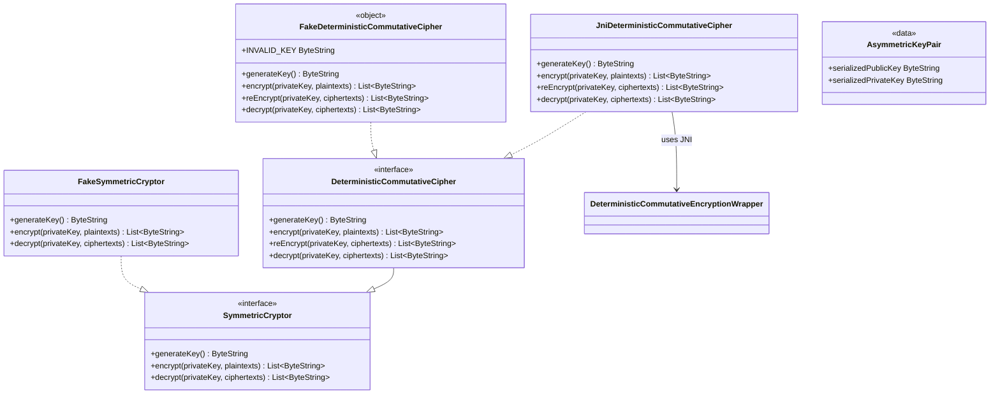

# org.wfanet.panelmatch.common.crypto

## Overview
Provides cryptographic primitives and utilities for panel matching operations, including deterministic commutative encryption, symmetric encryption, and secure key management. The package implements both production JNI-based cryptographic operations and testing utilities for verifying encryption workflows without external dependencies.

## Components

### SymmetricCryptor
Base interface for symmetric encryption operations using private keys.

| Method | Parameters | Returns | Description |
|--------|------------|---------|-------------|
| generateKey | - | `ByteString` | Generates symmetric encryption key |
| encrypt | `privateKey: ByteString`, `plaintexts: List<ByteString>` | `List<ByteString>` | Encrypts multiple plaintext values |
| decrypt | `privateKey: ByteString`, `ciphertexts: List<ByteString>` | `List<ByteString>` | Decrypts multiple ciphertext values |

### DeterministicCommutativeCipher
Interface extending SymmetricCryptor with commutative encryption properties enabling multi-party cryptographic protocols.

| Method | Parameters | Returns | Description |
|--------|------------|---------|-------------|
| generateKey | - | `ByteString` | Generates private key for encryption |
| encrypt | `privateKey: ByteString`, `plaintexts: List<ByteString>` | `List<ByteString>` | Encrypts plaintext values deterministically |
| reEncrypt | `privateKey: ByteString`, `ciphertexts: List<ByteString>` | `List<ByteString>` | Adds additional encryption layer to ciphertexts |
| decrypt | `privateKey: ByteString`, `ciphertexts: List<ByteString>` | `List<ByteString>` | Removes one encryption layer from ciphertexts |

### JniDeterministicCommutativeCipher
Production implementation of DeterministicCommutativeCipher using native JNI bindings to C++ cryptographic library.

| Method | Parameters | Returns | Description |
|--------|------------|---------|-------------|
| generateKey | - | `ByteString` | Generates cryptographic key via JNI wrapper |
| encrypt | `privateKey: ByteString`, `plaintexts: List<ByteString>` | `List<ByteString>` | Encrypts plaintexts using native implementation |
| reEncrypt | `privateKey: ByteString`, `ciphertexts: List<ByteString>` | `List<ByteString>` | Re-encrypts ciphertexts via JNI wrapper |
| decrypt | `privateKey: ByteString`, `ciphertexts: List<ByteString>` | `List<ByteString>` | Decrypts ciphertexts using native implementation |

**Implementation Notes:**
- Loads `deterministic_commutative_encryption` native library from `/main/swig/wfanet/panelmatch/protocol/crypto`
- Wraps all JNI exceptions using `wrapJniException` utility
- Communicates with native layer via Protocol Buffer serialization

## Data Structures

### AsymmetricKeyPair
Serializable container for asymmetric cryptographic key pairs.

| Property | Type | Description |
|----------|------|-------------|
| serializedPublicKey | `ByteString` | Serialized public key component |
| serializedPrivateKey | `ByteString` | Serialized private key component |

## Utility Functions

### generateSecureRandomByteString
Generates cryptographically secure random byte sequences using `SecureRandom.getInstanceStrong()`.

| Parameter | Type | Description |
|-----------|------|-------------|
| sizeBytes | `Int` | Number of random bytes to generate |
| **Returns** | `ByteString` | Secure random bytes |

## Testing Utilities

### FakeDeterministicCommutativeCipher
Test-only implementation of DeterministicCommutativeCipher using string concatenation for encryption simulation.

| Method | Parameters | Returns | Description |
|--------|------------|---------|-------------|
| generateKey | - | `ByteString` | Generates fake key with UUID |
| encrypt | `privateKey: ByteString`, `plaintexts: List<ByteString>` | `List<ByteString>` | Appends key to plaintext as encryption |
| reEncrypt | `privateKey: ByteString`, `ciphertexts: List<ByteString>` | `List<ByteString>` | Appends additional key to ciphertext |
| decrypt | `privateKey: ByteString`, `ciphertexts: List<ByteString>` | `List<ByteString>` | Removes key suffix from ciphertext |

**Properties:**
- `INVALID_KEY`: Special constant for testing error handling

**Limitations:** UTF-8 only, not suitable for production use.

### FakeSymmetricCryptor
Test-only implementation of SymmetricCryptor using simple string concatenation.

| Method | Parameters | Returns | Description |
|--------|------------|---------|-------------|
| generateKey | - | `ByteString` | Generates 20-character random alphabetic key |
| encrypt | `privateKey: ByteString`, `plaintexts: List<ByteString>` | `List<ByteString>` | Concatenates key as encryption suffix |
| decrypt | `privateKey: ByteString`, `ciphertexts: List<ByteString>` | `List<ByteString>` | Removes key suffix to decrypt |

**Limitations:** UTF-8 only, not cryptographically secure.

## Dependencies
- `com.google.protobuf` - Serialization of keys, plaintexts, and ciphertexts
- `org.wfanet.panelmatch.common` - Library loading utilities and JNI exception handling
- `org.wfanet.panelmatch.protocol` - Protocol Buffer message definitions for cryptographic operations
- `org.wfanet.panelmatch.protocol.crypto` - Native JNI wrapper interface
- `java.security.SecureRandom` - Cryptographically secure random number generation
- `java.util.UUID` - Unique identifier generation for test keys

## Usage Example
```kotlin
// Production usage with JNI implementation
val cipher: DeterministicCommutativeCipher = JniDeterministicCommutativeCipher()
val key1 = cipher.generateKey()
val key2 = cipher.generateKey()

// Encrypt plaintext with key1
val plaintexts = listOf("data1".toByteStringUtf8(), "data2".toByteStringUtf8())
val encrypted1 = cipher.encrypt(key1, plaintexts)

// Re-encrypt with key2 (commutative property)
val encrypted2 = cipher.reEncrypt(key2, encrypted1)

// Decrypt in reverse order
val decrypted1 = cipher.decrypt(key2, encrypted2)
val decrypted2 = cipher.decrypt(key1, decrypted1)

// Testing with fake implementation
val fakeCipher = FakeDeterministicCommutativeCipher
val testKey = fakeCipher.generateKey()
val testEncrypted = fakeCipher.encrypt(testKey, plaintexts)
```

## Class Diagram

