# org.wfanet.panelmatch.common.crypto.testing

## Overview
Provides testing utilities for cryptographic implementations in the panel match system. Contains abstract test base classes for verifying cipher behaviors and fake implementations for testing scenarios without real cryptographic operations.

## Components

### AbstractDeterministicCommutativeCipherTest
Abstract base class for testing DeterministicCommutativeCipher implementations with comprehensive encryption, re-encryption, and decryption validation.

| Method | Parameters | Returns | Description |
|--------|------------|---------|-------------|
| testCryptor | - | `Unit` | Verifies encryption commutativity and decryption correctness |
| invalid key | - | `Unit` | Ensures operations fail with invalid keys |
| invalid ciphertexts | - | `Unit` | Validates rejection of malformed ciphertexts |

**Required Properties:**
- `cipher: DeterministicCommutativeCipher` - The cipher implementation under test
- `privateKey1: ByteString` - First valid private key for testing
- `privateKey2: ByteString` - Second valid private key for testing
- `invalidKey: ByteString` - Invalid key for error case testing

### AbstractSymmetricCryptorTest
Abstract base class for testing SymmetricCryptor implementations with key generation, encryption, and decryption validation.

| Method | Parameters | Returns | Description |
|--------|------------|---------|-------------|
| generate keys should generate unique keys each time | - | `Unit` | Verifies key uniqueness across generations |
| encrypt result should not equal original data | - | `Unit` | Ensures encryption transforms plaintext |
| encrypt data and then decrypt result should equal original data | - | `Unit` | Validates round-trip encryption correctness |
| encrypt data with two different keys should not be equal | - | `Unit` | Ensures different keys produce different ciphertexts |

**Required Properties:**
- `cipher: SymmetricCryptor` - The symmetric cryptor implementation under test
- `privateKey1: ByteString` - First valid private key for testing
- `privateKey2: ByteString` - Second valid private key for testing

### FakeDeterministicCommutativeCipher
Singleton fake implementation of DeterministicCommutativeCipher for testing purposes using string concatenation instead of real cryptography.

| Method | Parameters | Returns | Description |
|--------|------------|---------|-------------|
| generateKey | - | `ByteString` | Generates fake key with UUID suffix |
| encrypt | `privateKey: ByteString`, `plaintexts: List<ByteString>` | `List<ByteString>` | Concatenates separator and key to plaintexts |
| reEncrypt | `privateKey: ByteString`, `ciphertexts: List<ByteString>` | `List<ByteString>` | Appends additional encryption layer to ciphertexts |
| decrypt | `privateKey: ByteString`, `ciphertexts: List<ByteString>` | `List<ByteString>` | Removes encryption suffix matching the key |

**Constants:**
- `INVALID_KEY: ByteString` - Predefined invalid key for testing error paths

**Limitations:**
- Only works with UTF-8 encoded data
- Not suitable for production use
- Encryption format: `[plaintext] encrypted by [key]`

### FakeSymmetricCryptor
Fake implementation of SymmetricCryptor for testing using simple string manipulation instead of real cryptographic operations.

| Method | Parameters | Returns | Description |
|--------|------------|---------|-------------|
| generateKey | - | `ByteString` | Generates random 20-character alphabetic key |
| encrypt | `privateKey: ByteString`, `plaintexts: List<ByteString>` | `List<ByteString>` | Appends separator and key to plaintexts |
| decrypt | `privateKey: ByteString`, `ciphertexts: List<ByteString>` | `List<ByteString>` | Removes encryption suffix from ciphertexts |

**Limitations:**
- Only works with UTF-8 encoded data
- Not cryptographically secure
- Encryption format: `[plaintext] encrypted by [key]`

## Dependencies
- `org.wfanet.panelmatch.common.crypto.DeterministicCommutativeCipher` - Interface for deterministic commutative encryption
- `org.wfanet.panelmatch.common.crypto.SymmetricCryptor` - Interface for symmetric encryption
- `com.google.protobuf.ByteString` - Binary data representation
- `org.junit.Test` - JUnit testing framework
- `com.google.common.truth` - Fluent assertion library
- `kotlinx.coroutines` - Coroutine support for async testing

## Usage Example
```kotlin
// Using the fake cipher for testing
val cipher = FakeDeterministicCommutativeCipher
val key1 = cipher.generateKey()
val key2 = cipher.generateKey()

val plaintexts = listOf("data1".toByteStringUtf8(), "data2".toByteStringUtf8())
val encrypted1 = cipher.encrypt(key1, plaintexts)
val encrypted2 = cipher.reEncrypt(key2, encrypted1)
val decrypted = cipher.decrypt(key1, encrypted2)
// decrypted contains data encrypted only with key2

// Extending abstract test classes
class MyCipherTest : AbstractDeterministicCommutativeCipherTest() {
  override val cipher = MyRealCipher()
  override val privateKey1 = cipher.generateKey()
  override val privateKey2 = cipher.generateKey()
  override val invalidKey = "bad-key".toByteStringUtf8()
}
```

## Class Diagram

```mermaid
classDiagram
    class AbstractDeterministicCommutativeCipherTest {
        <<abstract>>
        +cipher: DeterministicCommutativeCipher
        +privateKey1: ByteString
        +privateKey2: ByteString
        +invalidKey: ByteString
        +testCryptor() Unit
        +invalid key() Unit
        +invalid ciphertexts() Unit
    }

    class AbstractSymmetricCryptorTest {
        <<abstract>>
        #cipher: SymmetricCryptor
        #privateKey1: ByteString
        #privateKey2: ByteString
        +generate keys should generate unique keys each time() Unit
        +encrypt result should not equal original data() Unit
        +encrypt data and then decrypt result should equal original data() Unit
        +encrypt data with two different keys should not be equal() Unit
    }

    class FakeDeterministicCommutativeCipher {
        <<object>>
        +INVALID_KEY: ByteString
        +generateKey() ByteString
        +encrypt(privateKey: ByteString, plaintexts: List~ByteString~) List~ByteString~
        +reEncrypt(privateKey: ByteString, ciphertexts: List~ByteString~) List~ByteString~
        +decrypt(privateKey: ByteString, ciphertexts: List~ByteString~) List~ByteString~
    }

    class FakeSymmetricCryptor {
        +generateKey() ByteString
        +encrypt(privateKey: ByteString, plaintexts: List~ByteString~) List~ByteString~
        +decrypt(privateKey: ByteString, ciphertexts: List~ByteString~) List~ByteString~
    }

    class DeterministicCommutativeCipher {
        <<interface>>
    }

    class SymmetricCryptor {
        <<interface>>
    }

    AbstractDeterministicCommutativeCipherTest --> DeterministicCommutativeCipher
    AbstractSymmetricCryptorTest --> SymmetricCryptor
    FakeDeterministicCommutativeCipher ..|> DeterministicCommutativeCipher
    FakeSymmetricCryptor ..|> SymmetricCryptor
```

