# org.wfanet.panelmatch.common

## Overview
Common utilities and infrastructure for the Panel Match system, providing foundational components for data processing, cryptography, storage abstraction, certificate management, and Apache Beam integration. This package serves as the shared foundation for panel matching workflows across multiple data exchange partners.

## Components

### BlockingIterator
Iterator wrapper that converts coroutine-based ChannelIterator to blocking Iterator.

| Method | Parameters | Returns | Description |
|--------|------------|---------|-------------|
| hasNext | - | `Boolean` | Checks if more elements are available |
| next | - | `T` | Returns next element or throws NoSuchElementException |

### ExchangeDateKey
Identifies a specific exchange instance by recurring exchange ID and date.

| Property | Type | Description |
|----------|------|-------------|
| recurringExchangeId | `String` | Identifier for the recurring exchange |
| date | `LocalDate` | Date of this exchange instance |
| path | `String` | Computed storage path for the exchange |

### ShardedFileName
Represents sharded file sets with naming pattern "baseName-0001-of-9876".

| Method | Parameters | Returns | Description |
|--------|------------|---------|-------------|
| fileNameForShard | `i: Int` | `String` | Generates filename for specific shard index |

| Property | Type | Description |
|----------|------|-------------|
| spec | `String` | Shard specification pattern |
| shardCount | `Int` | Total number of shards |
| fileNames | `Sequence<String>` | All shard filenames |

### Timeout
Interface for duration-based timeout operations.

| Method | Parameters | Returns | Description |
|--------|------------|---------|-------------|
| runWithTimeout | `block: suspend CoroutineScope.() -> T` | `T` | Executes block with timeout constraint |

### JniException
RuntimeException indicating JNI/C++ code failures.

| Method | Parameters | Returns | Description |
|--------|------------|---------|-------------|
| wrapJniException | `block: () -> T` | `T` | Wraps block execution and converts RuntimeException to JniException |

### Fingerprinters
Cryptographic hashing utilities.

| Method | Parameters | Returns | Description |
|--------|------------|---------|-------------|
| sha256 | `bytes: ByteString` | `ByteString` | Computes SHA-256 hash |

## Crypto Subpackage

### SymmetricCryptor
Interface for symmetric encryption operations.

| Method | Parameters | Returns | Description |
|--------|------------|---------|-------------|
| generateKey | - | `ByteString` | Generates symmetric encryption key |
| encrypt | `privateKey: ByteString, plaintexts: List<ByteString>` | `List<ByteString>` | Encrypts multiple plaintexts |
| decrypt | `privateKey: ByteString, ciphertexts: List<ByteString>` | `List<ByteString>` | Decrypts multiple ciphertexts |

### DeterministicCommutativeCipher
Interface for deterministic commutative encryption (extends SymmetricCryptor).

| Method | Parameters | Returns | Description |
|--------|------------|---------|-------------|
| reEncrypt | `privateKey: ByteString, ciphertexts: List<ByteString>` | `List<ByteString>` | Adds encryption layer to ciphertexts |

### JniDeterministicCommutativeCipher
JNI-based implementation of DeterministicCommutativeCipher using native C++ library.

| Method | Parameters | Returns | Description |
|--------|------------|---------|-------------|
| generateKey | - | `ByteString` | Generates key via JNI wrapper |
| encrypt | `privateKey: ByteString, plaintexts: List<ByteString>` | `List<ByteString>` | Encrypts via JNI wrapper |
| reEncrypt | `privateKey: ByteString, ciphertexts: List<ByteString>` | `List<ByteString>` | Re-encrypts via JNI wrapper |
| decrypt | `privateKey: ByteString, ciphertexts: List<ByteString>` | `List<ByteString>` | Decrypts via JNI wrapper |

### AsymmetricKeyPair
Data class holding serialized public and private key pair.

| Property | Type | Description |
|----------|------|-------------|
| serializedPublicKey | `ByteString` | Serialized public key bytes |
| serializedPrivateKey | `ByteString` | Serialized private key bytes |

## Secrets Subpackage

### SecretMap
Read-only key-value store for sensitive ByteString values.

| Method | Parameters | Returns | Description |
|--------|------------|---------|-------------|
| get | `key: String` | `suspend ByteString?` | Retrieves secret value or null |

### MutableSecretMap
SecretMap with write capabilities.

| Method | Parameters | Returns | Description |
|--------|------------|---------|-------------|
| put | `key: String, value: ByteString` | `suspend Unit` | Stores or overwrites secret value |

### CsvSecretMap
SecretMap implementation reading from CSV file with base64-encoded values.

| Method | Parameters | Returns | Description |
|--------|------------|---------|-------------|
| get | `key: String` | `suspend ByteString?` | Retrieves value from CSV map |

### StorageClientSecretMap
MutableSecretMap storing each secret as separate blob in StorageClient.

| Method | Parameters | Returns | Description |
|--------|------------|---------|-------------|
| put | `key: String, value: ByteString` | `suspend Unit` | Writes secret as blob |
| get | `key: String` | `suspend ByteString?` | Reads secret from blob |

## Storage Subpackage

### StorageFactory
Functional interface for creating StorageClient instances.

| Method | Parameters | Returns | Description |
|--------|------------|---------|-------------|
| build | - | `StorageClient` | Creates StorageClient instance |
| build | `options: PipelineOptions?` | `StorageClient` | Creates StorageClient with pipeline options |

### PrefixedStorageClient
StorageClient decorator adding prefix to all blob keys.

| Method | Parameters | Returns | Description |
|--------|------------|---------|-------------|
| writeBlob | `blobKey: String, content: Flow<ByteString>` | `suspend Blob` | Writes blob with prefixed key |
| getBlob | `blobKey: String` | `suspend Blob?` | Retrieves blob with prefixed key |
| listBlobs | `prefix: String?` | `suspend Flow<Blob>` | Lists blobs with combined prefix |

### SizeLimitedStorageClient
StorageClient enforcing maximum blob size limits.

| Method | Parameters | Returns | Description |
|--------|------------|---------|-------------|
| writeBlob | `blobKey: String, content: Flow<ByteString>` | `suspend Blob` | Writes blob with size validation |
| getBlob | `blobKey: String` | `suspend Blob?` | Retrieves blob with size check |

### SizeLimitedStorageFactory
StorageFactory decorator applying size limits to created clients.

| Method | Parameters | Returns | Description |
|--------|------------|---------|-------------|
| withBlobSizeLimit | `sizeLimitBytes: Long` | `StorageFactory` | Wraps factory with size limit |

## Certificates Subpackage

### CertificateManager
Interface for managing X.509 certificates and private keys for exchanges.

| Method | Parameters | Returns | Description |
|--------|------------|---------|-------------|
| getCertificate | `exchange: ExchangeDateKey, certName: String` | `suspend X509Certificate` | Retrieves exchange certificate |
| getPartnerRootCertificate | `partnerName: String` | `suspend X509Certificate` | Retrieves partner root certificate |
| getExchangePrivateKey | `exchange: ExchangeDateKey` | `suspend PrivateKey` | Retrieves exchange private key |
| getExchangeKeyPair | `exchange: ExchangeDateKey` | `suspend KeyPair` | Retrieves certificate and private key pair |
| createForExchange | `exchange: ExchangeDateKey` | `suspend String` | Creates and stores new certificate |

### CertificateAuthority
Interface for creating signed X.509 certificates.

| Method | Parameters | Returns | Description |
|--------|------------|---------|-------------|
| generateX509CertificateAndPrivateKey | - | `suspend Pair<X509Certificate, PrivateKey>` | Generates signed certificate and key pair |

## Beam Subpackage

### BeamOptions
Pipeline options interface extending Dataflow options with AWS credentials.

| Property | Type | Description |
|----------|------|-------------|
| awsAccessKey | `String` | AWS access key identifier |
| awsSecretAccessKey | `String` | AWS secret access key |
| awsSessionToken | `String` | AWS session token |

### ReadShardedData
PTransform reading sharded protobuf data from storage into PCollection.

| Method | Parameters | Returns | Description |
|--------|------------|---------|-------------|
| expand | `input: PBegin` | `PCollection<T>` | Reads all shards into unified PCollection |

### WriteShardedData
PTransform writing PCollection elements to sharded files in storage.

| Method | Parameters | Returns | Description |
|--------|------------|---------|-------------|
| expand | `input: PCollection<T>` | `WriteResult` | Distributes and writes elements to shards |

### ReadAsSingletonPCollection
PTransform reading single blob into PCollection with one ByteString element.

| Method | Parameters | Returns | Description |
|--------|------------|---------|-------------|
| expand | `input: PBegin` | `PCollection<ByteString>` | Reads blob as singleton PCollection |

### WriteSingleBlob
PTransform writing single PCollection element to blob.

| Method | Parameters | Returns | Description |
|--------|------------|---------|-------------|
| expand | `input: PCollection<T>` | `WriteResult` | Writes singleton element to blob |

### BreakFusion
PTransform forcing materialization to prevent Dataflow operation fusion.

| Method | Parameters | Returns | Description |
|--------|------------|---------|-------------|
| expand | `input: PCollection<T>` | `PCollection<T>` | Forces PCollection materialization |

### Minus
PTransform computing set difference between two PCollections.

| Method | Parameters | Returns | Description |
|--------|------------|---------|-------------|
| expand | `input: PCollectionList<T>` | `PCollection<T>` | Returns items in first but not second |

## Extension Functions

### ByteString Extensions
| Function | Parameters | Returns | Description |
|----------|------------|---------|-------------|
| toBase64 | - | `String` | Encodes ByteString as Base64 string |
| parseDelimitedMessages | `prototype: T` | `Iterable<T>` | Parses length-delimited protobuf messages (deprecated) |

### Duration Extensions
| Function | Parameters | Returns | Description |
|----------|------------|---------|-------------|
| toProto | - | `com.google.protobuf.Duration` | Converts java.time.Duration to protobuf Duration |
| asTimeout | - | `Timeout` | Creates Timeout instance from Duration |

### Iterable Extensions
| Function | Parameters | Returns | Description |
|----------|------------|---------|-------------|
| singleOrNullIfEmpty | - | `T?` | Returns null if empty, single element, or throws |

### Stopwatch Extensions
| Function | Parameters | Returns | Description |
|----------|------------|---------|-------------|
| withTime | `block: () -> T` | `Pair<T, Duration>` | Executes block and returns result with elapsed time |

### Logger Extensions
| Function | Parameters | Returns | Description |
|----------|------------|---------|-------------|
| loggerFor | - | `Lazy<Logger>` | Creates lazy Logger for receiver's class |

### PCollection Extensions
| Function | Parameters | Returns | Description |
|----------|------------|---------|-------------|
| keys | - | `PCollection<KeyT>` | Extracts keys from KV PCollection |
| values | - | `PCollection<ValueT>` | Extracts values from KV PCollection |
| parDo | `doFn: DoFn<InT, OutT>` | `PCollection<OutT>` | Applies DoFn transformation |
| map | `processElement: (InT) -> OutT` | `PCollection<OutT>` | Maps each element |
| flatMap | `processElement: (InT) -> Iterable<OutT>` | `PCollection<OutT>` | FlatMaps each element to multiple outputs |
| filter | `predicate: (T) -> Boolean` | `PCollection<T>` | Filters elements by predicate |
| keyBy | `keySelector: (InputT) -> KeyT` | `PCollection<KV<KeyT, InputT>>` | Keys elements by selector function |
| mapKeys | `processKey: (InKeyT) -> OutKeyT` | `PCollection<KV<OutKeyT, ValueT>>` | Transforms only keys |
| mapValues | `processValue: (InValueT) -> OutValueT` | `PCollection<KV<KeyT, OutValueT>>` | Transforms only values |
| join | `right: PCollection<KV<KeyT, RightT>>, transform` | `PCollection<OutT>` | Joins two keyed PCollections |
| oneToOneJoin | `right: PCollection<KV<KeyT, RightT>>` | `PCollection<KV<LeftT?, RightT?>>` | Joins with at most one item per key |
| strictOneToOneJoin | `right: PCollection<KV<KeyT, RightT>>` | `PCollection<KV<LeftT, RightT>>` | Joins requiring exactly one item per key |
| groupByKey | - | `PCollection<KV<KeyT, Iterable<ValueT>>>` | Groups values by key |
| partition | `numParts: Int, partitionBy: (T) -> Int` | `PCollectionList<T>` | Partitions into multiple PCollections |
| count | - | `PCollectionView<Long>` | Counts PCollection elements |
| combineIntoList | - | `PCollection<List<T>>` | Combines all elements into single list |
| breakFusion | - | `PCollection<T>` | Forces materialization to break fusion |
| minus | `other: PCollection<T>` | `PCollection<T>` | Computes set difference |

### StorageClient Extensions
| Function | Parameters | Returns | Description |
|----------|------------|---------|-------------|
| withPrefix | `prefix: String` | `StorageClient` | Wraps client with prefix decorator |

### Blob Extensions
| Function | Parameters | Returns | Description |
|----------|------------|---------|-------------|
| toByteString | - | `suspend ByteString` | Reads entire blob into ByteString |
| toStringUtf8 | - | `suspend String` | Reads blob as UTF-8 string |
| newInputStream | `scope: CoroutineScope` | `InputStream` | Creates InputStream for blob |

### StorageFactory Extensions
| Function | Parameters | Returns | Description |
|----------|------------|---------|-------------|
| withBlobSizeLimit | `sizeLimitBytes: Long` | `StorageFactory` | Wraps factory with size limit |

## Top-Level Functions

| Function | Parameters | Returns | Description |
|----------|------------|---------|-------------|
| loadLibraryFromResource | `libraryName: String, resourcePathPrefix: String` | `Unit` | Loads embedded native library from JAR |
| generateSecureRandomByteString | `sizeBytes: Int` | `ByteString` | Generates cryptographically secure random bytes |
| kvOf | `key: KeyT, value: ValueT` | `KV<KeyT, ValueT>` | Creates Beam KV instance |
| assignToShard | `shardCount: Int` | `Int` | Assigns object to shard by hash |

## Dependencies
- `com.google.protobuf` - Protocol buffer serialization
- `org.apache.beam.sdk` - Apache Beam data processing framework
- `org.wfanet.measurement.storage` - Storage abstraction layer
- `kotlinx.coroutines` - Kotlin coroutines for async operations
- `com.google.common` - Guava utilities for hashing and collections
- `java.security` - Java cryptography and certificate APIs
- `java.time` - Java time and duration APIs

## Usage Example
```kotlin
// Storage with prefix and size limit
val factory: StorageFactory = baseFactory
    .withPrefix("exchange-data")
    .withBlobSizeLimit(100_000_000)
val storageClient = factory.build()

// Sharded file operations
val shardedFile = ShardedFileName("events", shardCount = 100)
shardedFile.fileNames.forEach { filename ->
    println(filename) // events-00-of-100, events-01-of-100, ...
}

// Secret management
val secretMap: MutableSecretMap = StorageClientSecretMap(storageClient)
secretMap.put("encryption-key", generateSecureRandomByteString(32))
val key = secretMap.get("encryption-key")

// Beam pipeline with extensions
val pipeline = Pipeline.create()
pipeline.apply(ReadShardedData(prototype, "input-*-of-100", factory))
    .map { processEvent(it) }
    .filter { it.isValid() }
    .keyBy { it.userId }
    .groupByKey()
    .apply(WriteShardedData("output-*-of-50", factory))

// Cryptography
val cipher: DeterministicCommutativeCipher = JniDeterministicCommutativeCipher()
val privateKey = cipher.generateKey()
val ciphertexts = cipher.encrypt(privateKey, plaintexts)
val reEncrypted = cipher.reEncrypt(anotherKey, ciphertexts)
```

## Class Diagram

```mermaid
classDiagram
    class SymmetricCryptor {
        <<interface>>
        +generateKey() ByteString
        +encrypt(privateKey, plaintexts) List~ByteString~
        +decrypt(privateKey, ciphertexts) List~ByteString~
    }

    class DeterministicCommutativeCipher {
        <<interface>>
        +reEncrypt(privateKey, ciphertexts) List~ByteString~
    }

    class JniDeterministicCommutativeCipher {
        +generateKey() ByteString
        +encrypt(privateKey, plaintexts) List~ByteString~
        +reEncrypt(privateKey, ciphertexts) List~ByteString~
        +decrypt(privateKey, ciphertexts) List~ByteString~
    }

    class SecretMap {
        <<interface>>
        +get(key) ByteString?
    }

    class MutableSecretMap {
        <<interface>>
        +put(key, value) Unit
    }

    class StorageClientSecretMap {
        -storageClient: StorageClient
        +put(key, value) Unit
        +get(key) ByteString?
    }

    class CsvSecretMap {
        -contents: Map~String, ByteString~
        +get(key) ByteString?
    }

    class StorageFactory {
        <<interface>>
        +build() StorageClient
        +build(options) StorageClient
    }

    class PrefixedStorageClient {
        -delegate: StorageClient
        -prefix: String
        +writeBlob(blobKey, content) Blob
        +getBlob(blobKey) Blob?
    }

    class SizeLimitedStorageClient {
        -sizeLimitBytes: Long
        -delegate: StorageClient
        +writeBlob(blobKey, content) Blob
        +getBlob(blobKey) Blob?
    }

    class CertificateManager {
        <<interface>>
        +getCertificate(exchange, certName) X509Certificate
        +getExchangeKeyPair(exchange) KeyPair
        +createForExchange(exchange) String
    }

    class CertificateAuthority {
        <<interface>>
        +generateX509CertificateAndPrivateKey() Pair
    }

    DeterministicCommutativeCipher --|> SymmetricCryptor
    JniDeterministicCommutativeCipher ..|> DeterministicCommutativeCipher
    MutableSecretMap --|> SecretMap
    StorageClientSecretMap ..|> MutableSecretMap
    CsvSecretMap ..|> SecretMap
    PrefixedStorageClient --> StorageClient
    SizeLimitedStorageClient --> StorageClient
    StorageClientSecretMap --> StorageClient
```

