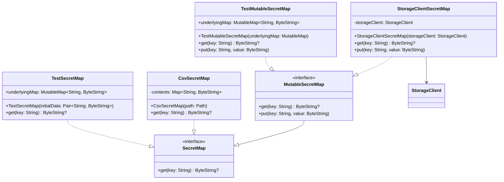

# org.wfanet.panelmatch.common.secrets

## Overview
This package provides a key-value store abstraction for managing sensitive binary data as ByteStrings. It defines interfaces and implementations for secure secret storage with support for both read-only and mutable operations, including file-based CSV storage, cloud storage backends, and in-memory test implementations.

## Components

### SecretMap
Core interface for read-only access to sensitive key-value pairs.

| Method | Parameters | Returns | Description |
|--------|------------|---------|-------------|
| get | `key: String` | `ByteString?` | Retrieves the value associated with the key or null if absent |

### MutableSecretMap
Extension of SecretMap that supports write operations.

| Method | Parameters | Returns | Description |
|--------|------------|---------|-------------|
| get | `key: String` | `ByteString?` | Retrieves the value associated with the key or null if absent |
| put | `key: String`, `value: ByteString` | `Unit` | Adds or overwrites a key-value mapping |

### CsvSecretMap
File-based implementation that reads secrets from CSV format with base64-encoded values.

| Method | Parameters | Returns | Description |
|--------|------------|---------|-------------|
| get | `key: String` | `ByteString?` | Retrieves the value for the given key from loaded CSV data |

**Constructor**: `CsvSecretMap(path: Path)`
- `path` - Filesystem path to CSV file with format: `key,base64EncodedValue`

### StorageClientSecretMap
Cloud storage implementation that stores each secret as a separate blob.

| Method | Parameters | Returns | Description |
|--------|------------|---------|-------------|
| get | `key: String` | `ByteString?` | Retrieves blob content by key from storage client |
| put | `key: String`, `value: ByteString` | `Unit` | Writes value as a blob using the key as blob name |

**Constructor**: `StorageClientSecretMap(storageClient: StorageClient)`
- `storageClient` - Storage backend for blob operations

## Testing Components

### TestSecretMap
In-memory implementation backed by a Map for testing read-only secret access.

| Property | Type | Description |
|----------|------|-------------|
| underlyingMap | `MutableMap<String, ByteString>` | Exposed internal map for test assertions |

| Method | Parameters | Returns | Description |
|--------|------------|---------|-------------|
| get | `key: String` | `ByteString?` | Retrieves value from underlying map |

**Constructor**: `TestSecretMap(vararg initialData: Pair<String, ByteString>)`
- `initialData` - Variable arguments of key-value pairs to initialize the map

### TestMutableSecretMap
In-memory implementation backed by a MutableMap for testing mutable secret operations.

| Property | Type | Description |
|----------|------|-------------|
| underlyingMap | `MutableMap<String, ByteString>` | Exposed internal map for test assertions |

| Method | Parameters | Returns | Description |
|--------|------------|---------|-------------|
| get | `key: String` | `ByteString?` | Retrieves value from underlying map |
| put | `key: String`, `value: ByteString` | `Unit` | Adds mapping, requiring key does not already exist |

**Constructor**: `TestMutableSecretMap(underlyingMap: MutableMap<String, ByteString> = mutableMapOf())`
- `underlyingMap` - Optional pre-populated map, defaults to empty

## Dependencies
- `com.google.protobuf` - ByteString type for representing binary secret data
- `org.wfanet.measurement.storage` - StorageClient abstraction for cloud storage operations
- `org.wfanet.panelmatch.common.storage` - Extension functions for ByteString conversion
- `java.nio.file` - Path handling for filesystem-based secret storage
- `java.util.Base64` - Decoding base64-encoded secret values from CSV

## Usage Example
```kotlin
// File-based CSV secrets
val csvSecrets = CsvSecretMap(Paths.get("/secure/secrets.csv"))
val apiKey = csvSecrets.get("api_key")

// Cloud storage secrets
val storageClient = StorageClient.fromConfig(config)
val cloudSecrets = StorageClientSecretMap(storageClient)
cloudSecrets.put("database_password", passwordBytes)
val retrieved = cloudSecrets.get("database_password")

// Testing with in-memory secrets
val testSecrets = TestMutableSecretMap()
testSecrets.put("test_key", "test_value".toByteStringUtf8())
assertThat(testSecrets.underlyingMap).containsKey("test_key")
```

## Class Diagram

