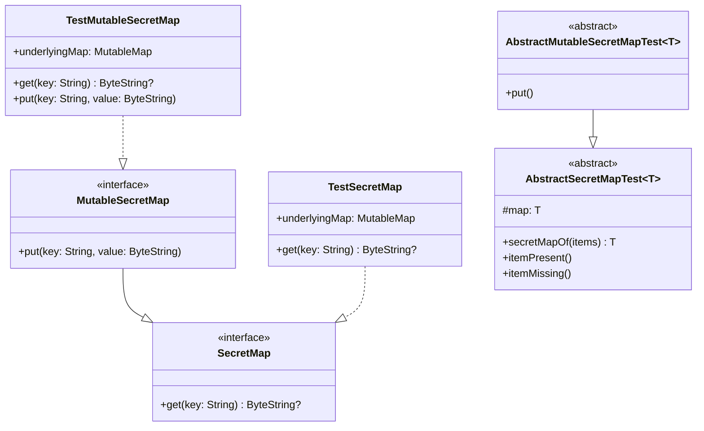

# org.wfanet.panelmatch.common.secrets.testing

## Overview
Provides testing utilities and abstract test classes for validating SecretMap and MutableSecretMap implementations. This package includes in-memory test implementations backed by standard Kotlin maps and reusable JUnit test suites for verifying conformance to the SecretMap contract.

## Components

### TestSecretMap
In-memory SecretMap implementation backed by a Map for testing purposes.

| Method | Parameters | Returns | Description |
|--------|------------|---------|-------------|
| get | `key: String` | `ByteString?` | Retrieves value associated with key or null |

**Constructor Parameters:**
- `initialData: vararg Pair<String, ByteString>` - Initial key-value pairs to populate the map

**Properties:**
- `underlyingMap: MutableMap<String, ByteString>` - Backing storage for secret data

### TestMutableSecretMap
In-memory MutableSecretMap implementation backed by a MutableMap for testing purposes.

| Method | Parameters | Returns | Description |
|--------|------------|---------|-------------|
| get | `key: String` | `ByteString?` | Retrieves value associated with key or null |
| put | `key: String, value: ByteString` | `Unit` | Adds mapping from key to value |

**Constructor Parameters:**
- `underlyingMap: MutableMap<String, ByteString>` - Backing storage (defaults to empty mutableMapOf())

**Properties:**
- `underlyingMap: MutableMap<String, ByteString>` - Backing storage for secret data

**Implementation Notes:**
- `put` method uses `putIfAbsent` and throws `IllegalArgumentException` if key already exists

### AbstractSecretMapTest
Abstract JUnit test class providing standard test coverage for SecretMap implementations.

| Method | Parameters | Returns | Description |
|--------|------------|---------|-------------|
| secretMapOf | `vararg items: Pair<String, ByteString>` | `T : SecretMap` | Factory method to create SecretMap instance |
| itemPresent | - | `Unit` | Verifies retrieval of existing keys |
| itemMissing | - | `Unit` | Verifies null return for missing keys |

**Properties:**
- `map: T` - Lazily initialized SecretMap instance for testing

**Test Coverage:**
- Validates successful retrieval of present items
- Validates null response for missing items

### AbstractMutableSecretMapTest
Abstract JUnit test class extending AbstractSecretMapTest for MutableSecretMap implementations.

| Method | Parameters | Returns | Description |
|--------|------------|---------|-------------|
| put | - | `Unit` | Verifies put operation and value overwriting |

**Test Coverage:**
- Validates inserting new key-value pairs
- Validates overwriting existing values
- Validates retrieval after insertion

## Dependencies
- `com.google.protobuf.ByteString` - Binary data representation for secret values
- `org.wfanet.panelmatch.common.secrets.SecretMap` - Base read-only secret storage interface
- `org.wfanet.panelmatch.common.secrets.MutableSecretMap` - Mutable secret storage interface
- `org.wfanet.panelmatch.common.testing.runBlockingTest` - Coroutine test utilities
- `com.google.common.truth.Truth` - Assertion library for tests
- `org.junit.Test` - JUnit testing framework

## Usage Example
```kotlin
// Implementing a custom SecretMap test
class MySecretMapTest : AbstractSecretMapTest<MySecretMap>() {
  override suspend fun secretMapOf(vararg items: Pair<String, ByteString>): MySecretMap {
    return MySecretMap(*items)
  }
}

// Implementing a custom MutableSecretMap test
class MyMutableSecretMapTest : AbstractMutableSecretMapTest<MyMutableSecretMap>() {
  override suspend fun secretMapOf(vararg items: Pair<String, ByteString>): MyMutableSecretMap {
    return MyMutableSecretMap().apply {
      items.forEach { (key, value) -> put(key, value) }
    }
  }
}

// Using test implementations directly
val secretMap = TestSecretMap(
  "api-key" to "secret123".toByteStringUtf8(),
  "token" to "token456".toByteStringUtf8()
)

val mutableMap = TestMutableSecretMap()
mutableMap.put("new-secret", "value".toByteStringUtf8())
```

## Class Diagram

