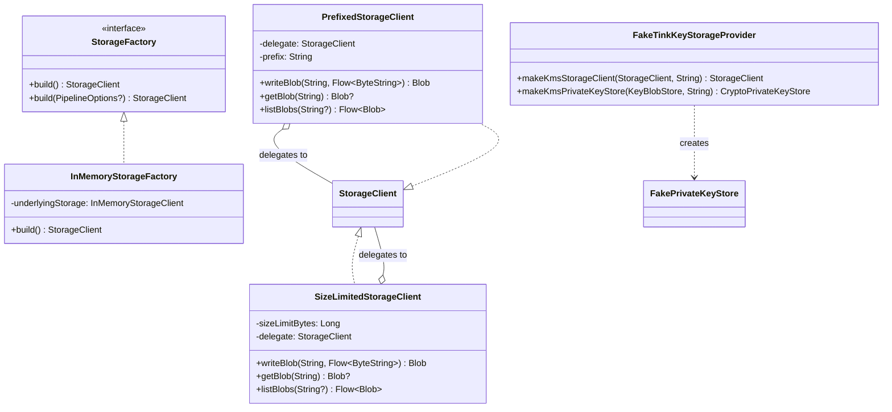

# org.wfanet.panelmatch.common.storage

## Overview
This package provides storage abstraction layers for the Panel Match system. It includes decorators for storage clients (prefix-based organization, size limits), extension utilities for blob manipulation, factory interfaces for creating storage instances, and testing utilities for in-memory storage implementations.

## Components

### StorageFactory
Functional interface for creating StorageClient instances with optional Apache Beam pipeline configuration.

| Method | Parameters | Returns | Description |
|--------|------------|---------|-------------|
| build | - | `StorageClient` | Creates a new storage client instance |
| build | `options: PipelineOptions?` | `StorageClient` | Creates storage client with pipeline options |

### PrefixedStorageClient
Decorator wrapping StorageClient to automatically prepend a prefix to all blob keys.

| Method | Parameters | Returns | Description |
|--------|------------|---------|-------------|
| writeBlob | `blobKey: String, content: Flow<ByteString>` | `StorageClient.Blob` | Writes blob with prefixed key |
| getBlob | `blobKey: String` | `StorageClient.Blob?` | Retrieves blob using prefixed key |
| listBlobs | `prefix: String?` | `Flow<StorageClient.Blob>` | Lists blobs with combined prefix |

### SizeLimitedStorageClient
Decorator enforcing maximum blob size constraints on read and write operations.

| Method | Parameters | Returns | Description |
|--------|------------|---------|-------------|
| writeBlob | `blobKey: String, content: Flow<ByteString>` | `StorageClient.Blob` | Writes blob, throwing if size exceeds limit |
| getBlob | `blobKey: String` | `StorageClient.Blob?` | Retrieves blob, checking size limit |
| listBlobs | `prefix: String?` | `Flow<StorageClient.Blob>` | Lists blobs with size-aware wrappers |

### InMemoryStorageFactory
Test implementation of StorageFactory backed by InMemoryStorageClient for unit testing.

| Method | Parameters | Returns | Description |
|--------|------------|---------|-------------|
| build | - | `StorageClient` | Returns the shared in-memory storage instance |

### FakeTinkKeyStorageProvider
Test stub for KeyStorageProvider that bypasses KMS encryption for testing scenarios.

| Method | Parameters | Returns | Description |
|--------|------------|---------|-------------|
| makeKmsStorageClient | `storageClient: StorageClient, keyUri: String` | `StorageClient` | Returns unmodified storage client |
| makeKmsPrivateKeyStore | `store: KeyBlobStore, keyUri: String` | `CryptoPrivateKeyStore<TinkKeyId, TinkPrivateKeyHandle>` | Returns fake private key store |

### FakePrivateKeyStore
Test stub for PrivateKeyStore with unimplemented methods for test scaffolding.

| Method | Parameters | Returns | Description |
|--------|------------|---------|-------------|
| read | `keyId: TinkKeyId` | `TinkPrivateKeyHandle?` | Throws TODO exception |
| write | `privateKey: TinkPrivateKeyHandle` | `String` | Throws TODO exception |

## Extensions

### Blob Extensions (Blobs.kt)

| Function | Parameters | Returns | Description |
|----------|------------|---------|-------------|
| toByteString | - | `ByteString` | Reads entire blob into single ByteString |
| toStringUtf8 | - | `String` | Reads blob as UTF-8 encoded string |
| newInputStream | `scope: CoroutineScope` | `InputStream` | Creates InputStream from blob in coroutine scope |

### StorageClient Extensions

| Function | Parameters | Returns | Description |
|----------|------------|---------|-------------|
| withPrefix | `prefix: String` | `StorageClient` | Wraps client with PrefixedStorageClient |

### StorageFactory Extensions

| Function | Parameters | Returns | Description |
|----------|------------|---------|-------------|
| withBlobSizeLimit | `sizeLimitBytes: Long` | `StorageFactory` | Wraps factory with size limit enforcement |

## Dependencies
- `org.wfanet.measurement.storage` - Core storage client abstractions
- `org.wfanet.measurement.common` - Common utilities (flatten extension)
- `org.wfanet.measurement.common.crypto` - Cryptographic key storage interfaces
- `com.google.protobuf` - ByteString for binary data handling
- `kotlinx.coroutines` - Asynchronous flow and coroutine support
- `org.apache.beam.sdk` - Pipeline options for distributed processing
- `com.google.common.collect` - Iterator utilities

## Usage Example
```kotlin
// Create size-limited storage with prefix
val factory: StorageFactory = InMemoryStorageFactory()
  .withBlobSizeLimit(1024 * 1024) // 1MB limit

val client = factory.build().withPrefix("tenant-123")

// Write and read blobs
val blob = client.writeBlob("data.bin", flowOf(ByteString.copyFromUtf8("content")))
val content = blob.toStringUtf8()

// Stream blob as InputStream
val inputStream = blob.newInputStream(coroutineScope)
```

## Class Diagram

