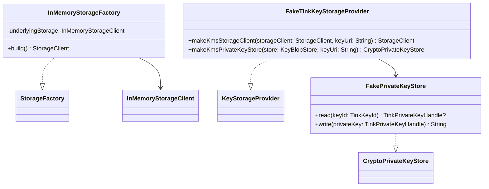

# org.wfanet.panelmatch.common.storage.testing

## Overview
This package provides test implementations and fake objects for storage and cryptographic key management components. It contains in-memory storage factories and stub implementations of key storage providers designed specifically for unit testing and development environments.

## Components

### InMemoryStorageFactory
Test implementation of StorageFactory backed by a single InMemoryStorageClient instance.

| Method | Parameters | Returns | Description |
|--------|------------|---------|-------------|
| build | - | `StorageClient` | Returns the underlying in-memory storage client |

**Constructor Parameters:**
| Parameter | Type | Default | Description |
|-----------|------|---------|-------------|
| underlyingStorage | `InMemoryStorageClient` | `InMemoryStorageClient()` | Backing storage client instance |

### FakeTinkKeyStorageProvider
Stub implementation of KeyStorageProvider for Tink-based cryptographic keys used in testing.

| Method | Parameters | Returns | Description |
|--------|------------|---------|-------------|
| makeKmsStorageClient | `storageClient: StorageClient`, `keyUri: String` | `StorageClient` | Returns the provided storage client unmodified |
| makeKmsPrivateKeyStore | `store: KeyBlobStore`, `keyUri: String` | `CryptoPrivateKeyStore<TinkKeyId, TinkPrivateKeyHandle>` | Creates a FakePrivateKeyStore instance |

### FakePrivateKeyStore
Internal stub implementation of PrivateKeyStore for Tink private key handles.

| Method | Parameters | Returns | Description |
|--------|------------|---------|-------------|
| read | `keyId: TinkKeyId` | `TinkPrivateKeyHandle?` | Reads a private key (not implemented) |
| write | `privateKey: TinkPrivateKeyHandle` | `String` | Writes a private key (not implemented) |

## Dependencies
- `org.wfanet.measurement.storage` - StorageClient interface and InMemoryStorageClient implementation
- `org.wfanet.measurement.common.crypto` - Cryptographic key storage interfaces (KeyStorageProvider, PrivateKeyStore, KeyBlobStore)
- `org.wfanet.measurement.common.crypto.tink` - Tink cryptographic library integration (TinkKeyId, TinkPrivateKeyHandle)
- `org.wfanet.panelmatch.common.storage` - StorageFactory interface

## Usage Example
```kotlin
// Create an in-memory storage factory for testing
val storageFactory = InMemoryStorageFactory()
val storageClient = storageFactory.build()

// Use the fake key storage provider in tests
val keyStorageProvider = FakeTinkKeyStorageProvider()
val kmsStorageClient = keyStorageProvider.makeKmsStorageClient(storageClient, "test-key-uri")
```

## Class Diagram

