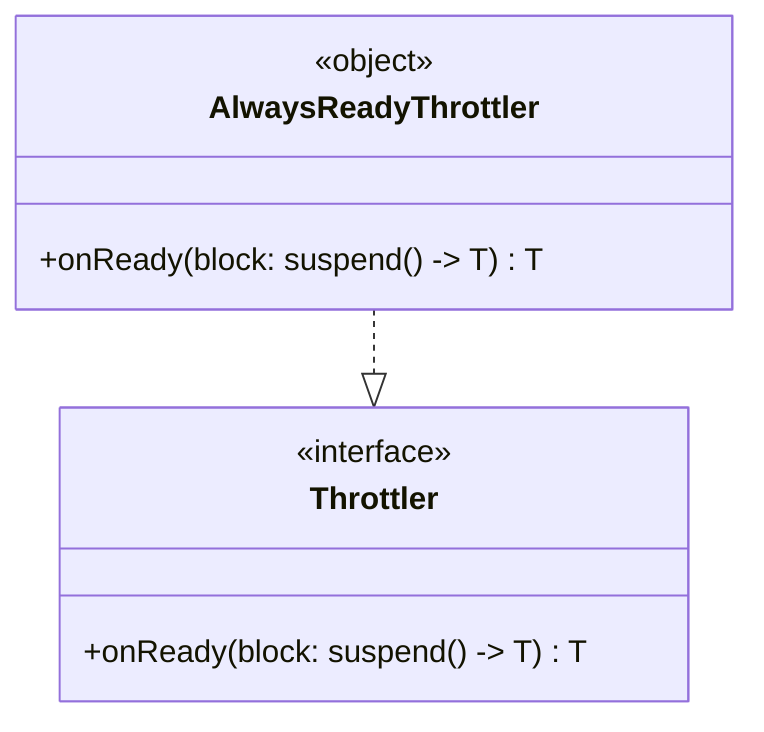

# org.wfanet.panelmatch.common.testing

## Overview
This package provides testing utilities for the PanelMatch common library. It contains helper implementations for throttling and coroutine testing that simplify test code by providing no-op or simplified behavior suitable for test environments.

## Components

### AlwaysReadyThrottler
A no-op implementation of the Throttler interface that immediately executes blocks without any throttling delay. Designed for testing scenarios where throttling behavior should be bypassed.

| Method | Parameters | Returns | Description |
|--------|------------|---------|-------------|
| onReady | `block: suspend () -> T` | `T` | Immediately executes the provided suspend block without throttling |

## Functions

### runBlockingTest
```kotlin
fun runBlockingTest(block: suspend CoroutineScope.() -> Unit)
```

Executes a suspend block in a blocking manner for test environments. Provides a workaround for issues with `kotlinx.coroutines.test.runBlockingTest` that causes "This job has not completed yet" errors. Uses standard `runBlocking` internally to avoid these compatibility issues.

| Parameter | Type | Description |
|-----------|------|-------------|
| block | `suspend CoroutineScope.() -> Unit` | The suspend block to execute in a blocking test context |

## Dependencies
- `org.wfanet.measurement.common.throttler` - Provides the Throttler interface
- `kotlinx.coroutines` - Provides coroutine primitives (CoroutineScope, runBlocking)

## Usage Example
```kotlin
// Using AlwaysReadyThrottler in tests
val throttler = AlwaysReadyThrottler
val result = throttler.onReady {
  // Code that normally would be throttled
  performExpensiveOperation()
}

// Using runBlockingTest for coroutine tests
runBlockingTest {
  val result = suspendingFunction()
  assertEquals(expected, result)
}
```

## Class Diagram

