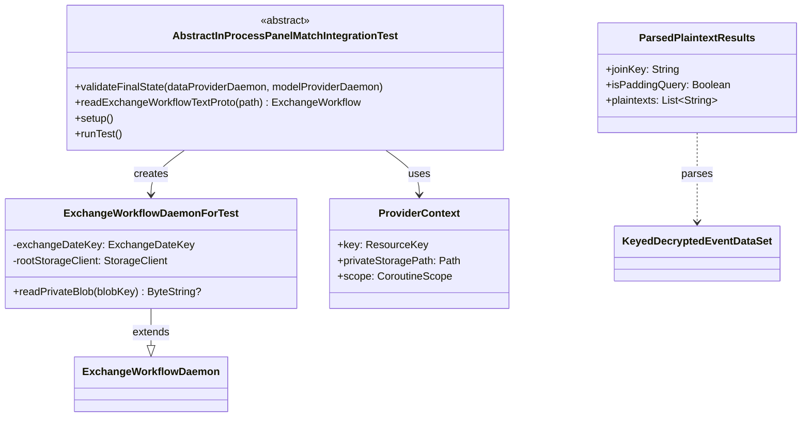

# org.wfanet.panelmatch.integration

## Overview
Provides integration testing infrastructure for Panel Match Exchange Workflows. Executes full end-to-end tests of exchange workflows in-process, orchestrating data and model provider daemons with Kingdom services, storage systems, and certificate management to validate complete workflow execution from initialization through final state verification.

## Components

### AbstractInProcessPanelMatchIntegrationTest
Abstract base class orchestrating full in-process end-to-end integration tests for ExchangeWorkflows.

| Method | Parameters | Returns | Description |
|--------|------------|---------|-------------|
| validateFinalState | `dataProviderDaemon: ExchangeWorkflowDaemonForTest`, `modelProviderDaemon: ExchangeWorkflowDaemonForTest` | `Unit` | Validates workflow final state assertions |
| readExchangeWorkflowTextProto | `exchangeWorkflowResourcePath: String` | `ExchangeWorkflow` | Parses ExchangeWorkflow from text proto resource |
| setup | - | `Unit` | Initializes test resources, storage, and contexts |
| runTest | - | `Unit` | Executes end-to-end workflow test scenario |

**Abstract Properties**
- `exchangeWorkflowResourcePath: String` - Path to workflow text proto definition
- `initialDataProviderInputs: Map<String, ByteString>` - Initial input blobs for data provider
- `initialModelProviderInputs: Map<String, ByteString>` - Initial input blobs for model provider
- `initialSharedInputs: MutableMap<String, ByteString>` - Initial shared storage inputs (default: empty)
- `finalSharedOutputs: Map<String, ByteString>` - Expected final shared outputs (default: empty)
- `workflow: ExchangeWorkflow` - The workflow configuration being tested

### ExchangeWorkflowDaemonForTest
Test daemon executing ExchangeWorkflows for in-process integration testing.

| Method | Parameters | Returns | Description |
|--------|------------|---------|-------------|
| readPrivateBlob | `blobKey: String` | `ByteString?` | Reads blob from private storage |

**Constructor Parameters**
| Parameter | Type | Description |
|-----------|------|-------------|
| v2alphaChannel | `Channel` | gRPC channel for Kingdom API |
| provider | `ResourceKey` | Data or Model provider identifier |
| exchangeDateKey | `ExchangeDateKey` | Exchange date identifier |
| privateDirectory | `Path` | Filesystem path for private storage |
| clock | `Clock` | Time source (default: system UTC) |
| pollingInterval | `Duration` | API polling frequency (default: 100ms) |
| taskTimeoutDuration | `Duration` | Task execution timeout (default: 2 minutes) |

**Overridden Properties**
- `validExchangeWorkflows: SecretMap` - Secret storage of workflow configurations
- `rootCertificates: SecretMap` - Certificate authority trust roots
- `privateStorageInfo: StorageDetailsProvider` - Private storage configuration provider
- `sharedStorageInfo: StorageDetailsProvider` - Shared storage configuration provider
- `certificateManager: CertificateManager` - Certificate operations manager (TestCertificateManager)
- `identity: Identity` - Provider identity (derived from ResourceKey)
- `apiClient: ApiClient` - Kingdom API client wrapper
- `throttler: Throttler` - Request rate limiter
- `runMode: RunMode` - Daemon execution mode (DAEMON)
- `exchangeTaskMapper: ExchangeTaskMapper` - Maps exchange steps to executable tasks
- `privateStorageFactories: Map<PlatformCase, (StorageDetails, ExchangeDateKey) -> StorageFactory>` - Factory for private storage clients
- `sharedStorageFactories: Map<PlatformCase, (StorageDetails, ExchangeDateKey) -> StorageFactory>` - Factory for shared storage clients
- `taskTimeout: Timeout` - Individual task execution timeout

## Data Structures

### ParsedPlaintextResults
Structured plaintext decryption results from workflow execution.

| Property | Type | Description |
|----------|------|-------------|
| joinKey | `String` | Plaintext join key identifier |
| isPaddingQuery | `Boolean` | Whether result is padding data |
| plaintexts | `List<String>` | Decrypted event payloads |

### ProviderContext (Private)
Internal context holder for provider test configuration.

| Property | Type | Description |
|----------|------|-------------|
| key | `ResourceKey` | Provider resource identifier |
| privateStoragePath | `Path` | Filesystem storage location |
| scope | `CoroutineScope` | Coroutine execution scope |

## Functions

### parsePlaintextResults
Parses plaintext results from decrypted event datasets.

| Parameter | Type | Description |
|-----------|------|-------------|
| combinedTexts | `Iterable<KeyedDecryptedEventDataSet>` | Encrypted event datasets |

**Returns:** `List<ParsedPlaintextResults>` - Structured plaintext data with join keys and payloads

## Dependencies
- `org.wfanet.measurement.api.v2alpha` - Kingdom Public API gRPC stubs and protos
- `org.wfanet.measurement.integration.common` - InProcessKingdom test infrastructure
- `org.wfanet.measurement.integration.deploy.gcloud` - Spanner-backed Kingdom services
- `org.wfanet.panelmatch.client.deploy` - Production daemon and task mapping
- `org.wfanet.panelmatch.client.storage` - Storage abstraction and filesystem implementation
- `org.wfanet.panelmatch.client.launcher` - API client wrappers
- `org.wfanet.panelmatch.common.certificates.testing` - Test certificate management
- `org.wfanet.panelmatch.common.storage.testing` - Fake crypto key storage
- `org.wfanet.panelmatch.client.privatemembership` - Private membership query operations
- `org.wfanet.panelmatch.client.eventpreprocessing` - Event preprocessing and combination
- `com.google.common.truth` - Test assertion framework
- `org.junit` - JUnit 4 test framework
- `kotlinx.coroutines` - Coroutine concurrency primitives

## Constants

| Constant | Value | Description |
|----------|-------|-------------|
| TERMINAL_STEP_STATES | `{SUCCEEDED, FAILED}` | Exchange step final states |
| READY_STEP_STATES | `{IN_PROGRESS, READY, READY_FOR_RETRY}` | Exchange step active states |
| TERMINAL_EXCHANGE_STATES | `{SUCCEEDED, FAILED}` | Exchange workflow final states |
| SCHEDULE | `"@daily"` | Default recurring exchange schedule |
| REDIRECT_URI | `"https://localhost:2048"` | OAuth redirect URI for testing |
| TEST_PADDING_NONCE_PREFIX | `"[Padding Nonce]"` | Prefix for padding query identifiers |

## Usage Example
```kotlin
class MyWorkflowIntegrationTest : AbstractInProcessPanelMatchIntegrationTest() {
  override val exchangeWorkflowResourcePath = "/workflows/my_workflow.textproto"

  override val initialDataProviderInputs = mapOf(
    "input-data" to ByteString.copyFromUtf8("edp-data")
  )

  override val initialModelProviderInputs = mapOf(
    "model-config" to ByteString.copyFromUtf8("mp-config")
  )

  override val workflow: ExchangeWorkflow by lazy {
    readExchangeWorkflowTextProto(exchangeWorkflowResourcePath)
  }

  override fun validateFinalState(
    dataProviderDaemon: ExchangeWorkflowDaemonForTest,
    modelProviderDaemon: ExchangeWorkflowDaemonForTest,
  ) {
    val result = modelProviderDaemon.readPrivateBlob("output-results")
    assertThat(result).isNotNull()
  }
}
```

## Class Diagram

