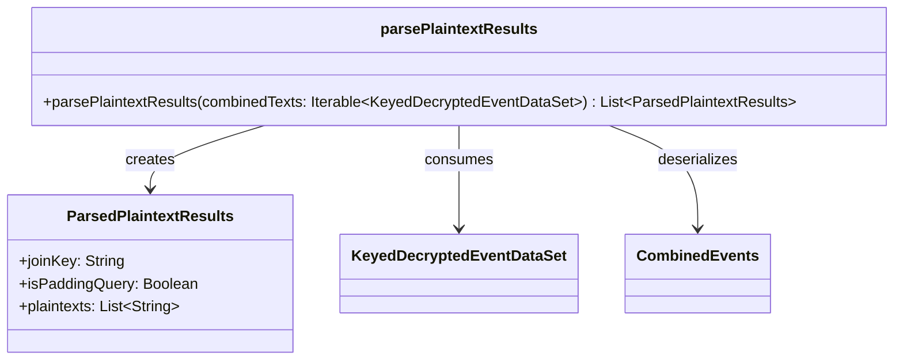

# org.wfanet.panelmatch.integration.testing

## Overview
Provides testing utilities for parsing and validating decrypted panel match workflow results. This package focuses on extracting plaintext data from encrypted event datasets and distinguishing between actual queries and padding queries used in privacy-preserving protocols.

## Components

### parsePlaintextResults
Top-level function that transforms encrypted event data into human-readable test results.

| Function | Parameters | Returns | Description |
|----------|------------|---------|-------------|
| parsePlaintextResults | `combinedTexts: Iterable<KeyedDecryptedEventDataSet>` | `List<ParsedPlaintextResults>` | Parses decrypted event datasets into structured plaintext results with join keys and payloads |

## Data Structures

### ParsedPlaintextResults
Represents the decrypted and parsed result of a single query in the panel match workflow.

| Property | Type | Description |
|----------|------|-------------|
| joinKey | `String` | The plaintext join key used to correlate events across datasets |
| isPaddingQuery | `Boolean` | Indicates whether this is a padding query (used for privacy) or actual data |
| plaintexts | `List<String>` | Collection of decrypted event payloads as UTF-8 strings |

## Constants

| Name | Type | Value | Description |
|------|------|-------|-------------|
| TEST_PADDING_NONCE_PREFIX | `String` | "[Padding Nonce]" | Prefix applied to padding query payloads for test identification |

## Dependencies
- `org.wfanet.panelmatch.client.eventpreprocessing` - Provides `CombinedEvents` protobuf message for serialized event aggregation
- `org.wfanet.panelmatch.client.privatemembership` - Supplies `KeyedDecryptedEventDataSet` and `isPaddingQuery` for encrypted data handling

## Usage Example
```kotlin
import org.wfanet.panelmatch.integration.testing.parsePlaintextResults
import org.wfanet.panelmatch.client.privatemembership.KeyedDecryptedEventDataSet

// After decrypting private membership query results
val decryptedDatasets: List<KeyedDecryptedEventDataSet> = getDecryptedResults()

// Parse into readable test results
val results = parsePlaintextResults(decryptedDatasets)

// Verify non-padding queries contain expected events
results.filterNot { it.isPaddingQuery }.forEach { result ->
  println("Join Key: ${result.joinKey}")
  println("Events: ${result.plaintexts}")
}

// Check padding queries are properly formatted
val paddingResults = results.filter { it.isPaddingQuery }
assert(paddingResults.all { it.plaintexts.single().startsWith(TEST_PADDING_NONCE_PREFIX) })
```

## Implementation Details

### Parsing Logic
The `parsePlaintextResults` function handles two distinct data formats:

1. **Padding Queries**: Extracts a single nonce value and prefixes it with `TEST_PADDING_NONCE_PREFIX`
2. **Actual Queries**: Deserializes each `DecryptedEventData` payload as a `CombinedEvents` protobuf and flattens all serialized events into a single list

### Privacy Protocol Support
The function respects the `isPaddingQuery` flag from the `JoinKeyIdentifier` to correctly interpret the payload format. Padding queries are essential for differential privacy guarantees in private set intersection protocols.

## Class Diagram

