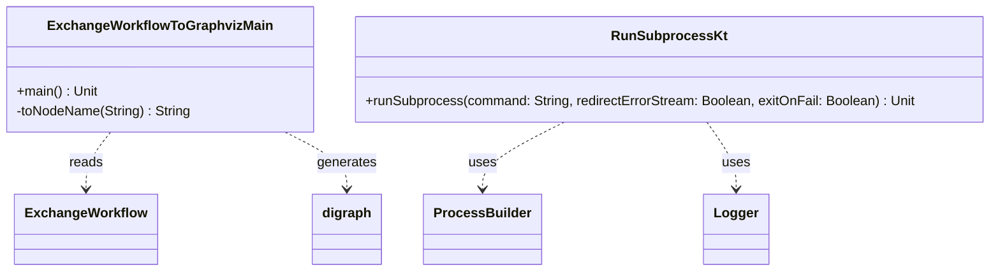

# org.wfanet.panelmatch.tools

## Overview
This package provides command-line utilities and helper functions for panel matching operations. It includes tools for visualizing exchange workflows as Graphviz diagrams and executing subprocesses with logging support.

## Components

### ExchangeWorkflowToGraphvizMain

A command-line tool that reads an ExchangeWorkflow protobuf message from stdin (in text format) and outputs a Graphviz DOT format diagram representing the workflow structure.

| Function | Parameters | Returns | Description |
|----------|------------|---------|-------------|
| main | - | `Unit` | Reads ExchangeWorkflow from stdin, generates Graphviz digraph |

**Key Features:**
- Reads protobuf TextFormat from standard input
- Groups workflow steps by party (DATA_PROVIDER, MODEL_PROVIDER)
- Color codes nodes by party (blue for data provider, red for model provider)
- Differentiates between step nodes (boxes) and blob/data nodes (eggs)
- Outputs Graphviz DOT format to stdout

### RunSubprocess

Utility function for executing external processes with enhanced logging and error handling.

| Function | Parameters | Returns | Description |
|----------|------------|---------|-------------|
| runSubprocess | `command: String, redirectErrorStream: Boolean = true, exitOnFail: Boolean = true` | `Unit` | Executes subprocess with logging and error handling |

**Parameters:**
- `command`: Shell command to execute (space-delimited)
- `redirectErrorStream`: Whether to redirect stderr to stdout (default: true)
- `exitOnFail`: Whether to throw exception on non-zero exit code (default: true)

**Behavior:**
- Logs command execution start
- Streams stdout to info logger
- Streams stderr to severe logger (if not redirected)
- Waits for process completion
- Throws exception if process exits with non-zero code and exitOnFail is true

## Dependencies

- `org.wfanet.measurement.api.v2alpha` - ExchangeWorkflow protobuf definitions
- `org.wfanet.measurement.common.graphviz` - Graphviz DSL for diagram generation
- `com.google.protobuf` - Protocol buffer text format parsing
- `kotlinx.coroutines` - Asynchronous stream processing for subprocess output
- `java.util.logging` - Logging infrastructure

## Usage Example

```kotlin
// Visualize an exchange workflow
// Command line: cat workflow.textproto | ./ExchangeWorkflowToGraphvizMain > workflow.dot

// Run a subprocess with logging
runSubprocess("docker build -t myimage .")

// Run without throwing on error
runSubprocess(
  command = "test -f somefile.txt",
  exitOnFail = false
)
```

## Class Diagram


